# AI Destekli Test Otomasyonu — Mimari Dokümantasyon

**Tarih:** 2026-04-03
**Kapsam:** BGTS platformunun mevcut altyapısı üzerine inşa edilecek AI test otomasyon mimarisi

---

## İçindekiler

1. [Genel Mimari](#1-genel-mimari)
2. [AI Test Engine](#2-ai-test-engine)
3. [Data Pipeline](#3-data-pipeline)
4. [Test Yürütme Katmanı](#4-test-yürütme-katmanı)
5. [Self-Learning Feedback Loop](#5-self-learning-feedback-loop)
6. [CI/CD Entegrasyon Mimarisi](#6-cicd-entegrasyon-mimarisi)
7. [Raporlama ve Dashboard](#7-raporlama-ve-dashboard)
8. [LLM Gateway Mimarisi](#8-llm-gateway-mimarisi)
9. [Veri Akış Diyagramları](#9-veri-akış-diyagramları)

---

## 1. Genel Mimari

BGTS AI Test Otomasyon mimarisi, mevcut monorepo yapısının üzerine 6 ana katmandan oluşur:

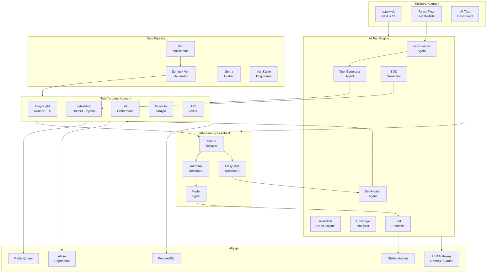

### Katman Açıklamaları

| Katman | Görev | Mevcut Durum |
|--------|-------|--------------|
| **Kullanıcı Katmanı** | Test yönetimi UI, flow editörü, dashboard | Next.js 14 + React Flow mevcut |
| **AI Test Engine** | Akıllı test planlama, üretme, onarım | BDD generation MVP mevcut; genişletilecek |
| **Data Pipeline** | Sentetik veri üretimi ve maskeleme | `ai_synthetic_data/` MVP mevcut |
| **Test Yürütme** | Testlerin çalıştırılması | Playwright, pytest-bdd, k6 mevcut |
| **Altyapı** | Veritabanı, kuyruk, CI/CD, LLM | Tamamı mevcut |
| **Feedback Loop** | Sonuç analizi ve model iyileştirme | Yeni — inşa edilecek |

---

## 2. AI Test Engine

AI Test Engine, 7 adet özelleşmiş servisten oluşur. Her servis `engine/` Flask uygulaması altında bir modül olarak konumlanır.

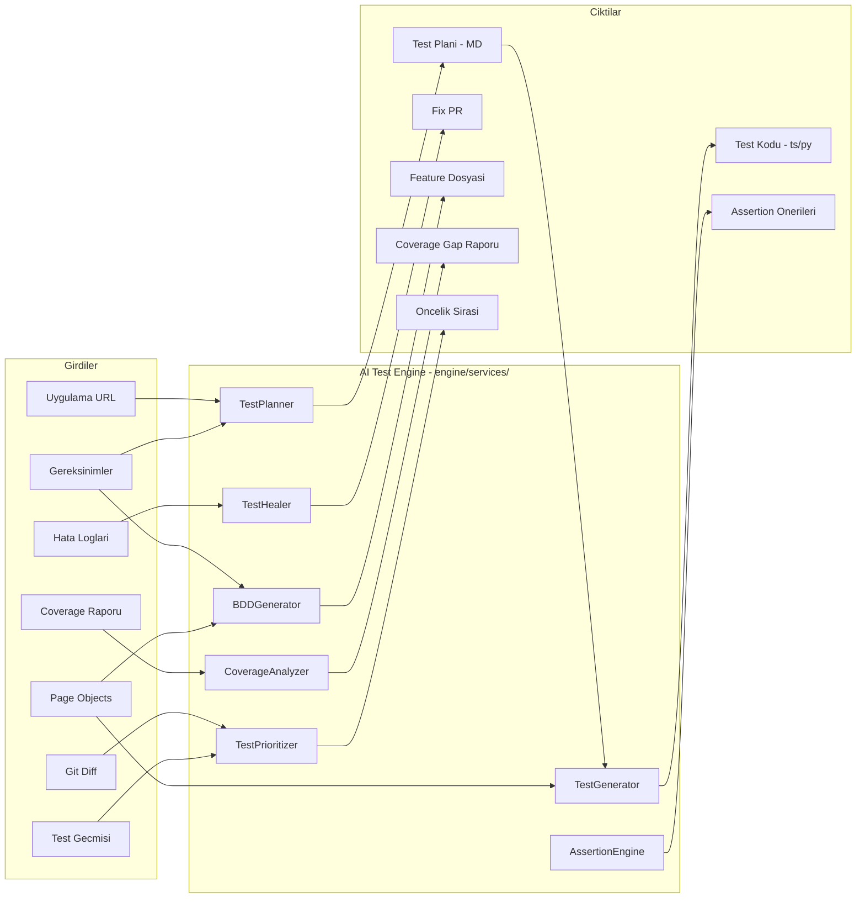

### 2.1 Test Planner Agent

Uygulamayı explore ederek kapsamlı test planı çıkaran agent.

**Mimari:**
```
URL + Gereksinimler
    ↓
Playwright MCP → Accessibility Snapshot
    ↓
LLM (GPT-4o) → Test Planı (Markdown)
    ↓
Review & Onay
    ↓
Test Generator Agent'a İlet
```

**Bileşenler:**
- `engine/services/test_planner.py` — Ana planlama servisi
- Playwright MCP client — tarayıcı erişimi
- LLM client — plan üretimi
- Plan template — tutarlı çıktı formatı

**Girdi/Çıktı:**
| Girdi | Çıktı |
|-------|-------|
| Uygulama URL'si | Markdown test planı |
| Gereksinim dokümanı | Sayfa listesi ve akışlar |
| Kapsam parametreleri | Öncelikli test senaryoları |

### 2.2 Test Generator Agent

Test planından çalıştırılabilir test kodu üreten agent.

**Mimari:**
```
Test Planı (MD) + Page Object Repository
    ↓
Context Builder → LLM Prompt Assembly
    ↓
LLM (GPT-4o / Claude) → Raw Test Code
    ↓
Code Validator → Syntax Check + Lint
    ↓
Dry Run → Çalışabilirlik Doğrulama
    ↓
.spec.ts / .feature + step_defs
```

**Bileşenler:**
- `engine/services/test_generator.py` — Ana üretim servisi
- Context builder — page object + framework bilgisi derleme
- Code validator — syntax check, lint, import validation
- Template engine — framework-spesifik şablonlar

### 2.3 Self-Healer Agent

Başarısız testleri otomatik onaran agent.

**Mimari:**
```
Test Failure
    ↓
Error Collector → Hata Logu + DOM Snapshot + Screenshot
    ↓
Locator History DB → Önceki Başarılı Locator
    ↓
DOM Diff Engine → Değişiklik Analizi
    ↓
Multi-Attribute Fingerprint → Yeni Element Tespiti
    ↓
LLM (gerekirse) → Locator Üretimi
    ↓
Retry → Test Yeniden Çalıştırma
    ↓
┌─ Başarılı → Locator Repository Güncelle + Healing Raporu
└─ Başarısız → Gerçek Bug Raporu
```

**Healing Stratejileri (Öncelik Sırasıyla):**

1. **data-testid fallback** — Element'in testId'si değişmişse yakın eşleşme ara
2. **Role + Label eşleşme** — ARIA role ve label ile bul
3. **Text content eşleşme** — Görünen metin ile bul
4. **Positional heuristic** — DOM tree'deki konum ile bul
5. **LLM-assisted** — Tüm strateji başarısızsa LLM'e sor

### 2.4 BDD Generator

Doğal dil gereksinimlerden Gherkin senaryoları üreten servis.

**Mimari:**
```
Doğal Dil Gereksinim
    ↓
Domain Context Loader → Bankacılık terminolojisi + İş kuralları
    ↓
Step Library Scanner → Mevcut step definition'lar
    ↓
LLM → Gherkin Feature + Scenario
    ↓
Step Matcher → Mevcut step'lerle eşleştir
    ↓
Missing Step Generator → Eksik step taslakları
    ↓
.feature + step_defs.py
```

### 2.5 Test Prioritizer

Kod değişikliklerinden etkilenen testleri risk skoruna göre sıralayan servis.

**Mimari:**
```
Git Diff + Test Geçmişi
    ↓
File Dependency Analyzer → Değişen dosyaların test bağlantıları
    ↓
Risk Scorer
    ├── Dosya bağımlılığı skoru (0-1)
    ├── Geçmiş başarısızlık oranı (0-1)
    ├── Son değişiklik yakınlığı (0-1)
    └── Test süresi faktörü (0-1)
    ↓
Weighted Score → Sıralı Test Listesi
    ↓
CI/CD Pipeline → Öncelikli yürütme
```

---

## 3. Data Pipeline

Sentetik veri üretimi, maskeleme ve kalite doğrulama pipeline'ı.

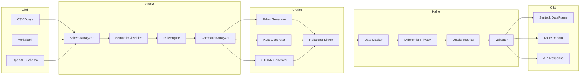

### Pipeline Fazları

| Faz | Açıklama | Mevcut Durum | Hedef |
|-----|----------|--------------|-------|
| **Analiz** | Şema ve dağılım çıkarma | SchemaAnalyzer + SemanticClassifier mevcut | CorrelationAnalyzer eklenmeli |
| **Üretim** | Sentetik veri oluşturma | Faker-based MVP | KDE → CTGAN progression |
| **Kalite** | Gizlilik ve doğrulama | PII detection mevcut | Diferansiyel gizlilik + kalite metrikleri |
| **Çıktı** | Veri dağıtımı | DataFrame + API | Kalite raporu eklenmeli |

---

## 4. Test Yürütme Katmanı

Mevcut runner'ların AI ile zenginleştirilmiş versiyonu.

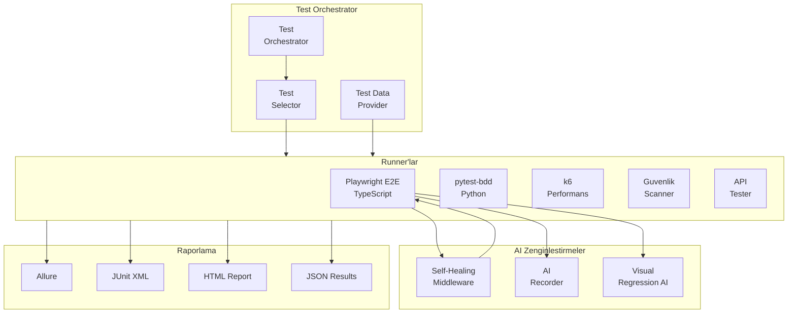

### Runner Detayları

| Runner | Dosya Konumu | AI Zenginleştirme |
|--------|-------------|-------------------|
| **Playwright E2E** | `e2e/*.spec.ts` | Self-healing, AI recorder, visual regression |
| **pytest-bdd** | `engine/tests/`, `engine/steps/` | BDD generation, assertion önerisi |
| **k6** | `tests/performance/*.js` | Anomaly detection, profil optimizasyon |
| **Güvenlik** | Yeni modül | Shannon/ZAP entegrasyonu |
| **API** | `api-tests/tests/` | Schema-based generation, fuzz testing |

---

## 5. Self-Learning Feedback Loop

Test sonuçlarından öğrenen ve sürekli iyileşen kapalı döngü sistemi.

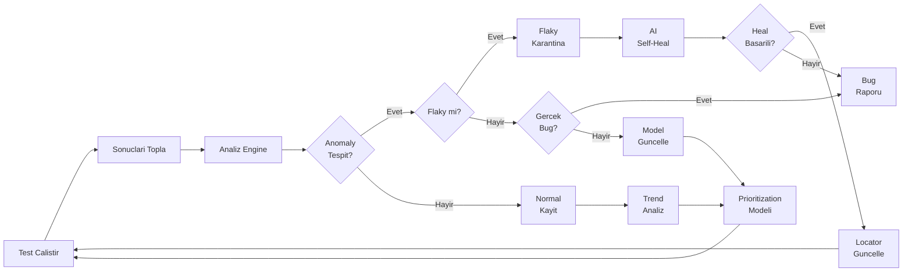

### Feedback Loop Bileşenleri

**1. Sonuç Toplayıcı (Result Collector)**
- Allure JSON, JUnit XML, k6 JSON sonuçlarını toplar
- Test metadata (süre, retry sayısı, hata türü) ile zenginleştirir
- PostgreSQL'e zaman serisi olarak yazar

**2. Anomaly Dedektörü**
- Z-score tabanlı basit anomaly detection (Faz 1)
- Isolation Forest ile gelişmiş tespit (Faz 2)
- Kategori: performans anomaly, başarı oranı anomaly, süre anomaly

**3. Flaky Test Dedektörü**
- Geçmiş N çalışmada başarı/başarısızlık varyansını analiz eder
- Flaky skoru: 0 (stabil) — 1 (tamamen rastgele)
- Eşik değeri (ör. 0.3) aşanlar karantinaya alınır

**4. Model Eğitici**
- Test sonuç geçmişinden prioritization modeli eğitir
- Feature'lar: dosya bağımlılığı, değişiklik sıklığı, başarısızlık oranı
- Periyodik re-training (haftalık)

---

## 6. CI/CD Entegrasyon Mimarisi

Mevcut GitHub Actions workflow'larının AI ile zenginleştirilmesi.

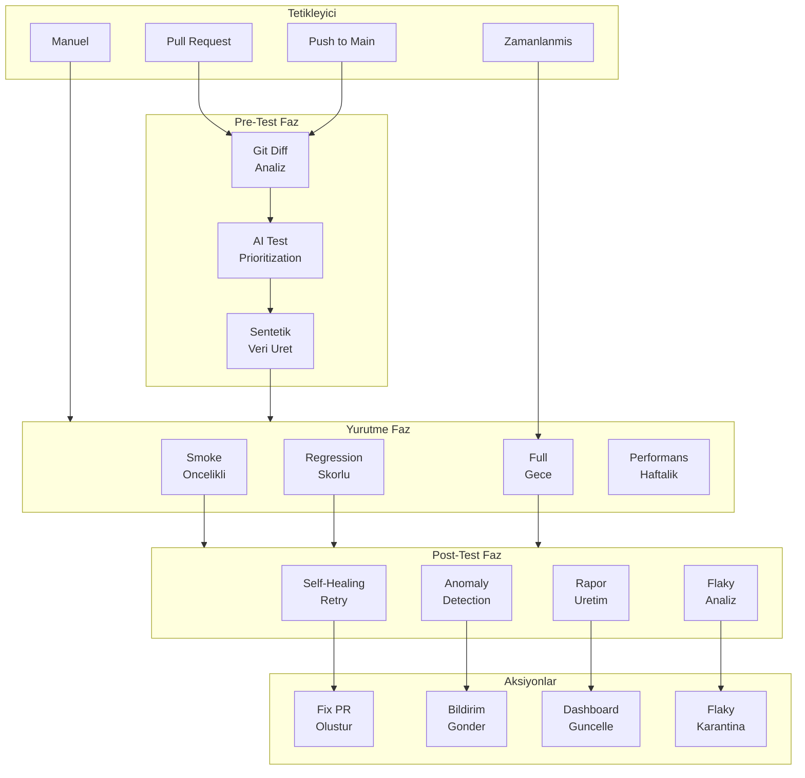

### CI/CD Akışı (Detay)

**PR Açıldığında:**
1. Git diff analizi → değişen dosyalar belirlenir
2. AI Test Prioritizer → etkilenen testler sıralanır
3. Sentetik veri üretici → gerekli test data hazırlanır
4. Smoke testler + en yüksek skorlu regression testleri çalışır
5. Başarısız testler → self-healing retry (1 deneme)
6. Heal edilemeyenler → fix PR önerisi veya bug raporu
7. Anomaly detection → performans/stabilite sapması kontrolü
8. Dashboard güncellenir

**Nightly (Her Gece):**
1. Full regression suite çalışır
2. Coverage gap analizi → yeni test önerileri
3. Flaky test analizi → karantina listesi güncellenir
4. AI test generation → yeni coverage gap'leri için test üretir
5. Trend raporu oluşturulur

**Haftalık:**
1. k6 performans testleri çalışır
2. Baseline karşılaştırma + anomaly detection
3. Güvenlik taraması (Shannon/ZAP)
4. Model re-training (prioritization)

---

## 7. Raporlama ve Dashboard

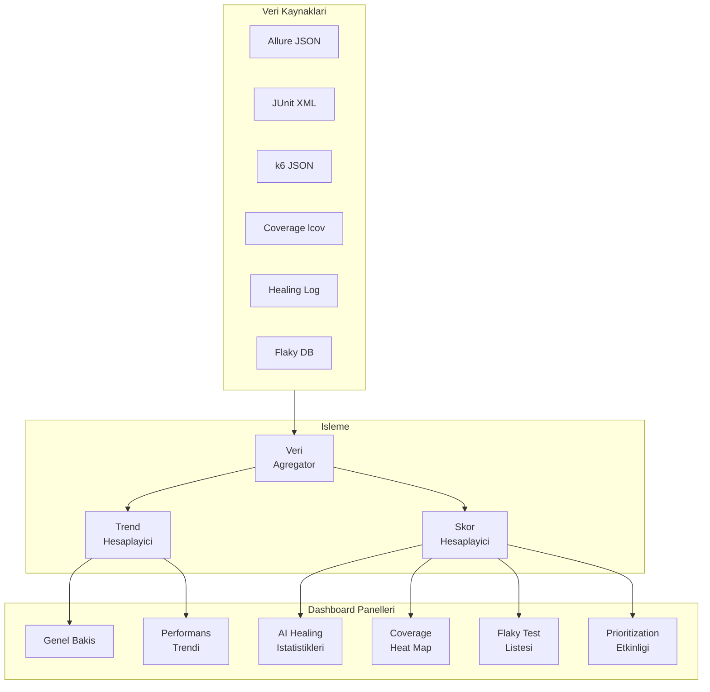

### Dashboard Panelleri

| Panel | İçerik | Veri Kaynağı |
|-------|--------|-------------|
| **Genel Bakış** | Toplam test, başarı oranı, trend, son çalışma | Allure + JUnit |
| **AI Healing** | Heal edilen test sayısı, healing oranı, locator değişiklikleri | Healing log |
| **Coverage Heat Map** | Modül bazlı coverage, gap'ler, öneriler | Coverage raporu |
| **Flaky Testler** | Flaky skor, karantina listesi, trend | Flaky DB |
| **Performans** | Response time trend, anomaly'ler, SLA uyumu | k6 JSON |
| **Prioritization** | Sıralama etkinliği, tahmin doğruluğu, zaman tasarrufu | Test geçmişi |

---

## 8. LLM Gateway Mimarisi

Tüm AI servislerinin merkezi LLM erişim noktası.

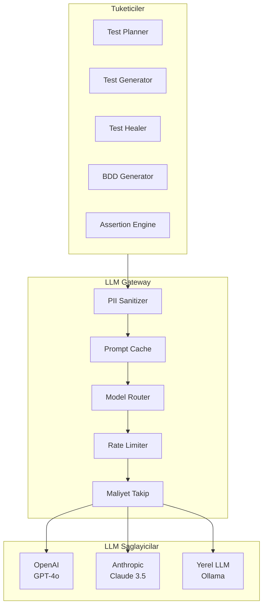

### Gateway Bileşenleri

| Bileşen | Görev |
|---------|-------|
| **PII Sanitizer** | LLM'e gönderilmeden önce hassas verileri maskeler |
| **Prompt Cache** | Aynı/benzer prompt'lar için cache (maliyet azaltma) |
| **Model Router** | Görev karmaşıklığına göre model seçimi (basit → küçük model, karmaşık → GPT-4o) |
| **Rate Limiter** | API çağrı limitlerini yönetir |
| **Maliyet Takip** | LLM kullanım maliyetini izler ve bütçe uyarısı verir |

### Model Seçim Stratejisi

| Görev | Önerilen Model | Gerekçe |
|-------|---------------|---------|
| Test planı oluşturma | GPT-4o | Yüksek kalite, detaylı analiz |
| Locator üretimi | Claude 3.5 Haiku | Hızlı, düşük maliyet |
| BDD senaryo üretimi | GPT-4o | Domain bilgisi, Türkçe kalite |
| Self-healing | Claude 3.5 Sonnet | DOM analiz yeteneği |
| Assertion önerisi | GPT-4o | Kod kalitesi |
| Basit sınıflandırma | Yerel LLM (Ollama) | Maliyet sıfır, gizlilik |

---

## 9. Veri Akış Diyagramları

### 9.1 Test Üretim Akışı

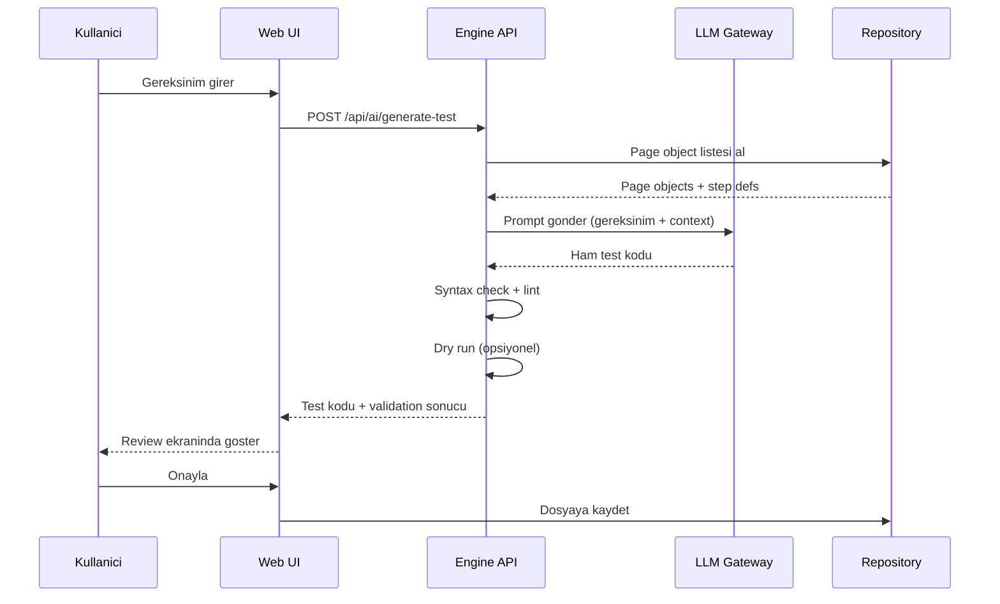

### 9.2 Self-Healing Akışı

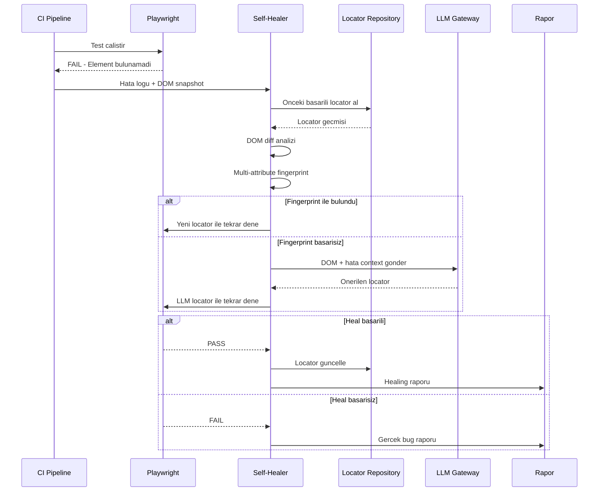

### 9.3 Feedback Loop Akışı

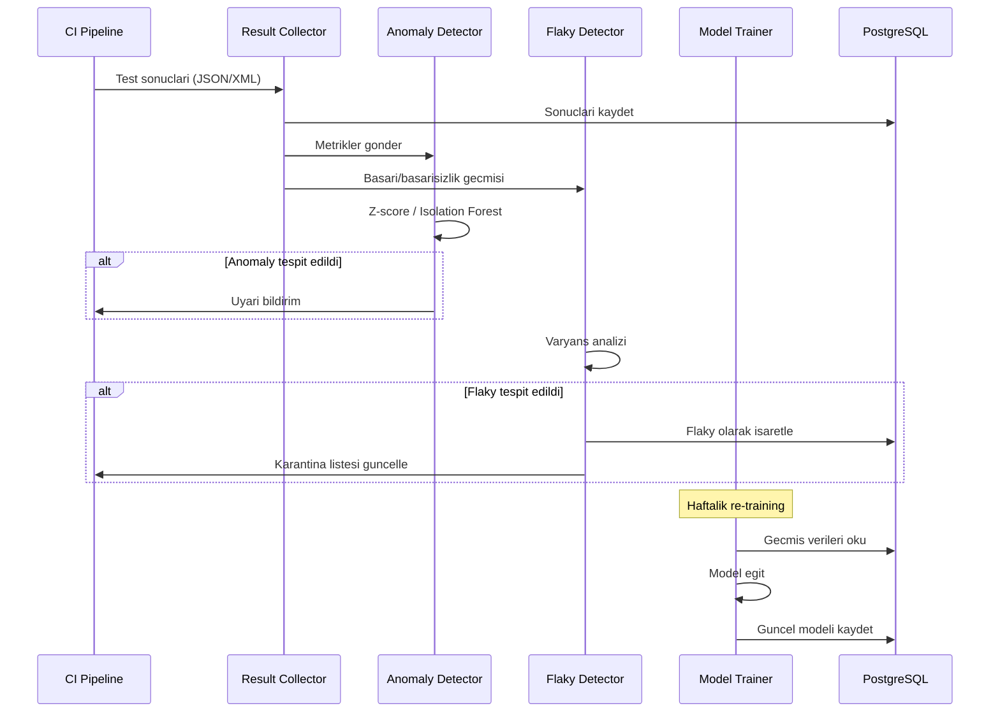
