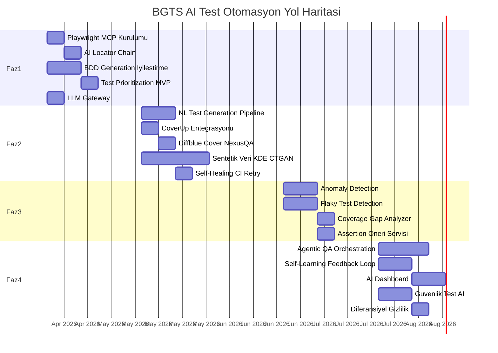

# AI Test Otomasyonu — Uygulama Yol Haritası

**Tarih:** 2026-04-03
**Kapsam:** BGTS platformu için AI destekli test otomasyon özelliklerinin 5 fazlı uygulama planı
**Toplam Süre:** ~20 hafta (Faz 1-4) + sürekli iyileştirme (Faz 5)

---

## Yol Haritası Özet Görünümü

---

## Faz 1: Temel AI Entegrasyonu (4 Hafta)

**Dönem:** Hafta 1–4
**Hedef:** Mevcut altyapıyı AI yetenekleri ile donatma, hızlı ROI sağlama

### 1.1 Playwright MCP + Healer Agent Kurulumu

| Özellik | Detay |
|---------|-------|
| **Süre** | 1 hafta |
| **Sorumluluk** | Test Otomasyon Mühendisi |
| **Bağımlılık** | Yok |
| **Girdi** | Mevcut Playwright E2E altyapısı |
| **Çıktı** | MCP konfigürasyonu, Healer Agent entegrasyonu |

**Görevler:**
1. Playwright MCP paketini E2E projesine ekle
2. `e2e/config/mcp-config.ts` konfigürasyon dosyasını oluştur
3. Healer Agent'ı `playwright.config.ts`'e entegre et (retries: 2, healer: enabled)
4. `e2e/utils/self-healer.ts` middleware'i implemente et
5. Smoke testlerde healing denemesi yap, sonuçları değerlendir
6. Healing log yapısını oluştur (`reports/healing-log.json`)

**Başarı Kriterleri:**
- MCP accessibility snapshot'ları çalışır durumda
- En az 1 kırık locator başarıyla heal edilmiş
- Healing logu oluşturulmuş ve okunabilir

### 1.2 AI Locator Fallback Chain

| Özellik | Detay |
|---------|-------|
| **Süre** | 1 hafta |
| **Sorumluluk** | Test Otomasyon Mühendisi |
| **Bağımlılık** | 1.1 (MCP kurulumu) |
| **Girdi** | Mevcut data-testid convention |
| **Çıktı** | `e2e/utils/ai-locator.ts` modülü |

**Görevler:**
1. `findElement()` fonksiyonunu implemente et (6 strateji)
2. Engine'de `/api/ai/find-element` endpoint'i oluştur
3. BasePage'e AI locator desteği ekle (opsiyonel helper)
4. Locator history mekanizmasını kur
5. Mevcut testlerin %10'unda A/B testi yap (AI locator vs mevcut)

**Başarı Kriterleri:**
- 6 kademeli locator chain çalışıyor
- Engine API endpoint'i accessibility snapshot'tan locator dönüyor
- data-testid olmayan elementlerde AI fallback çalışıyor

### 1.3 BDD Generation Akışı İyileştirmesi

| Özellik | Detay |
|---------|-------|
| **Süre** | 2 hafta |
| **Sorumluluk** | Backend Geliştirici + QA Mühendisi |
| **Bağımlılık** | 1.5 (LLM Gateway) |
| **Girdi** | Mevcut engine AI entegrasyonu, `bdd-generate.spec.ts` |
| **Çıktı** | Gelişmiş BDD generator servisi |

**Görevler:**
1. `engine/services/bdd_generator.py` servisini implemente et
2. Mevcut step definition kütüphanesini otomatik tara
3. Step eşleştirme mekanizmasını kur (yeni step vs mevcut step)
4. Türkçe gereksinim → Türkçe Gherkin dönüşüm kalitesini iyileştir
5. Edge case ve negatif senaryo önerisi ekle
6. E2E'deki `bdd-generate.spec.ts` akışını güncelle

**Başarı Kriterleri:**
- 5 farklı gereksinimden hatasız Gherkin üretimi
- Step eşleştirme oranı > %60 (mevcut step kütüphanesinden)
- Üretilen feature dosyaları pytest-bdd ile çalışıyor

### 1.4 Test Prioritization MVP

| Özellik | Detay |
|---------|-------|
| **Süre** | 1 hafta |
| **Sorumluluk** | DevOps + QA Mühendisi |
| **Bağımlılık** | 1.1 |
| **Girdi** | Git diff, test dosya listesi |
| **Çıktı** | `engine/services/test_prioritizer.py` |

**Görevler:**
1. Git diff parser implemente et
2. Dosya bağımlılık haritasını oluştur (manuel başlangıç)
3. Basit risk skoru hesaplayıcı yaz (dependency + failure rate)
4. GitHub Actions workflow'a pre-test step ekle
5. Sonuçları logla ve etkinliği ölç

**Başarı Kriterleri:**
- PR'da değişen dosyalara bağlı testler tespit ediliyor
- Sıralama mantıklı ve tutarlı
- CI süresinde ölçülebilir iyileşme (hedef: %20)

### 1.5 LLM Gateway

| Özellik | Detay |
|---------|-------|
| **Süre** | 1 hafta (1.3 ile paralel) |
| **Sorumluluk** | Backend Geliştirici |
| **Bağımlılık** | Yok |
| **Girdi** | Mevcut OpenAI/Anthropic SDK'ları |
| **Çıktı** | `engine/services/llm_gateway.py` |

**Görevler:**
1. Merkezi LLM Gateway servisini implemente et
2. PII sanitization pipeline'ı kur
3. Prompt cache mekanizmasını ekle
4. Maliyet takip ve bütçe limiti
5. Model router (görev karmaşıklığına göre model seçimi)
6. Mevcut engine LLM çağrılarını gateway üzerinden yönlendir

**Başarı Kriterleri:**
- Tüm LLM çağrıları merkezi gateway üzerinden geçiyor
- PII maskeleme çalışıyor
- Cache hit oranı > %20
- Maliyet takibi dashboard'da görünüyor

---

## Faz 2: Gelişmiş Üretim (6 Hafta)

**Dönem:** Hafta 5–10
**Hedef:** AI test üretim pipeline'larının olgunlaştırılması

### 2.1 Natural Language → Test Generation Pipeline

| Özellik | Detay |
|---------|-------|
| **Süre** | 2 hafta |
| **Bağımlılık** | Faz 1 tamamlanmış |
| **Çıktı** | `engine/services/ai_test_generator.py` + API endpoint'leri |

**Görevler:**
1. Test generator servisini implemente et (TypeScript + Python çıktı)
2. Page Object repository context builder'ı yaz
3. Code validation pipeline kur (syntax + lint + dry-run)
4. Web UI'da "AI ile Test Oluştur" butonunu ekle
5. Üretilen testleri `ai-generated/` dizinine kaydet
6. Review workflow entegrasyonu (pending → approved → active)

**KPI:** 10 farklı gereksinimden %80 başarı ile çalışan test üretimi

### 2.2 CoverUp Entegrasyonu (Python)

| Özellik | Detay |
|---------|-------|
| **Süre** | 1 hafta |
| **Bağımlılık** | Mevcut pytest-cov |
| **Çıktı** | CI'da otomatik coverage artırma |

**Görevler:**
1. CoverUp'ı engine/backend gereksinimlere ekle
2. Mevcut coverage raporunu CoverUp'a girdi olarak ver
3. Üretilen testleri `tests/ai_generated/` altına kaydet
4. Nightly CI'da otomatik çalıştır
5. Coverage artış trendini raporla

**KPI:** Backend Python coverage %60 → %75

### 2.3 Diffblue Cover Entegrasyonu (Java/NexusQA)

| Özellik | Detay |
|---------|-------|
| **Süre** | 1 hafta |
| **Bağımlılık** | Diffblue lisansı |
| **Çıktı** | NexusQA projesi için otomatik unit test üretimi |

**Görevler:**
1. Diffblue Cover lisansını temin et
2. NexusQA Maven projesine entegre et
3. Mevcut Java sınıfları için test üretimi çalıştır
4. Üretilen testleri review et ve merge et
5. Legacy → Playwright migration yol haritasına girdi sağla

**KPI:** NexusQA Java coverage %40 → %65

### 2.4 Sentetik Veri Faz 1-2 (KDE + CTGAN)

| Özellik | Detay |
|---------|-------|
| **Süre** | 4 hafta |
| **Bağımlılık** | Mevcut `ai_synthetic_data/` modülü |
| **Çıktı** | KDE generator + CTGAN generator + FK bütünlüğü |

**Görevler:**
(Detay: `docs/synthetic-data-research.md` Faz 1-2)
1. KDE (Kernel Density Estimation) generator ekle
2. Koşullu dağılım modülü ekle (segment ↔ bakiye korelasyonu)
3. CTGAN modeli entegre et (SDV kütüphanesi)
4. FK bütünlüğü modülü ekle (Customer → Account → Transaction)
5. Kalite metrikleri modülü ekle (KL divergence, korelasyon karşılaştırma)
6. API endpoint'lerini güncelle

**KPI:** Korelasyon koruma oranı > %80, FK bütünlüğü %100

### 2.5 Self-Healing CI Retry

| Özellik | Detay |
|---------|-------|
| **Süre** | 1 hafta |
| **Bağımlılık** | 1.1 (Healer Agent) |
| **Çıktı** | CI pipeline'da akıllı retry mekanizması |

**Görevler:**
1. GitHub Actions workflow'a self-healing retry step ekle
2. Healing sonuçlarını artifact olarak kaydet
3. Healing log'ları Allure raporuna ekle
4. Healing dashboard panelini oluştur
5. Aylık healing review toplantısını planla

**KPI:** CI pipeline stabilitesi > %90

---

## Faz 3: Akıllı Analiz (4 Hafta)

**Dönem:** Hafta 11–14
**Hedef:** Veriden öğrenen analiz katmanları

### 3.1 Anomaly Detection Layer

| Özellik | Detay |
|---------|-------|
| **Süre** | 2 hafta |
| **Çıktı** | `engine/services/anomaly_detector.py` + uyarı entegrasyonu |

**Görevler:**
1. Z-score tabanlı anomaly detector implemente et
2. Test sonuçları (süre, başarı, hata türü) metrikleri topla
3. k6 performans verileri analiz modülü ekle
4. Uyarı mekanizması kur (Slack/email/GitHub comment)
5. False positive oranını ölç ve threshold'ları ayarla

**KPI:** Performans regresyonu tespit süresi < 24 saat

### 3.2 Flaky Test Detection + Karantina

| Özellik | Detay |
|---------|-------|
| **Süre** | 2 hafta |
| **Çıktı** | `engine/services/flaky_detector.py` + karantina mekanizması |

**Görevler:**
1. Flaky skoru hesaplayıcı implemente et
2. Test geçmişi veritabanını oluştur
3. Karantina listesi mekanizması kur (pytest --deselect)
4. Nightly flaky analiz job'ı ekle
5. Flaky dashboard paneli oluştur
6. Haftalık flaky review süreci başlat

**KPI:** Flaky test oranı < %5, flaky testlerin %80'i 2 hafta içinde düzeltilmiş

### 3.3 Coverage Gap Analyzer

| Özellik | Detay |
|---------|-------|
| **Süre** | 1 hafta |
| **Bağımlılık** | 2.2 (CoverUp) |
| **Çıktı** | `engine/services/coverage_analyzer.py` + gap raporu |

**Görevler:**
1. Coverage raporu parser implemente et
2. Gap önceliklendirme algoritması yaz
3. LLM ile test önerisi üretimi ekle
4. Nightly coverage gap raporu oluştur
5. Dashboard'a coverage heat map ekle

**KPI:** Her hafta en az 3 coverage gap kapatılmış

### 3.4 Assertion Öneri Servisi

| Özellik | Detay |
|---------|-------|
| **Süre** | 1 hafta |
| **Çıktı** | `engine/services/assertion_engine.py` |

**Görevler:**
1. Test fonksiyonu AST parser'ı yaz
2. Mevcut assertion analizi modülü ekle
3. LLM ile assertion önerisi üretimi
4. Nightly analiz job'ı ekle
5. Önerileri rapor olarak sun

**KPI:** Test başına ortalama assertion sayısı artışı

---

## Faz 4: Otonom QA (6 Hafta)

**Dönem:** Hafta 15–20
**Hedef:** Kendi kendine öğrenen otonom test sistemi

### 4.1 Agentic QA Orchestration

| Özellik | Detay |
|---------|-------|
| **Süre** | 3 hafta |
| **Çıktı** | Plan-Act-Verify döngüsü |

**Görevler:**
1. Test Planner Agent'ı implemente et (URL exploration → test planı)
2. Plan → Generate → Execute döngüsünü kur
3. Execute → Verify → Report pipeline'ı oluştur
4. Hata durumunda otomatik re-plan mekanizması
5. Otonom keşif modu (exploration testing)
6. A/B test: otonom vs manuel test karşılaştırması

**KPI:** Otonom keşif ile en az 3 insan gözden kaçırmış bug tespiti

### 4.2 Self-Learning Feedback Loop

| Özellik | Detay |
|---------|-------|
| **Süre** | 2 hafta |
| **Çıktı** | Sonuç → Analiz → Model Güncelleme → Prioritization döngüsü |

**Görevler:**
1. Test sonuç toplayıcıyı implemente et
2. Anomaly → Flaky → Healing zincirini bağla
3. Prioritization model re-training pipeline'ı kur
4. Haftalık otomatik model güncelleme
5. Model performans metrikleri izleme

**KPI:** Prioritization tahmin doğruluğu > %75

### 4.3 AI Dashboard

| Özellik | Detay |
|---------|-------|
| **Süre** | 2 hafta |
| **Çıktı** | Next.js dashboard sayfaları |

**Görevler:**
1. AI Test Genel Bakış paneli
2. Healing İstatistikleri paneli
3. Coverage Heat Map paneli
4. Flaky Test Listesi paneli
5. LLM Maliyet Takip paneli
6. Performans Trend paneli

**KPI:** Dashboard günlük kullanım oranı > %50 (QA ekibi)

### 4.4 Güvenlik Test AI Entegrasyonu

| Özellik | Detay |
|---------|-------|
| **Süre** | 2 hafta |
| **Çıktı** | ZAP + Shannon entegrasyonu |

**Görevler:**
1. OWASP ZAP CI entegrasyonu
2. OpenAPI spec tabanlı API güvenlik taraması
3. Shannon otonom pentester değerlendirmesi
4. Güvenlik bulgu raporlama
5. Haftalık güvenlik tarama job'ı

**KPI:** OWASP Top 10 tüm kategorilerde tarama mevcut

### 4.5 Diferansiyel Gizlilik

| Özellik | Detay |
|---------|-------|
| **Süre** | 1 hafta |
| **Bağımlılık** | 2.4 (Sentetik veri Faz 1-2) |
| **Çıktı** | Diferansiyel gizlilik katmanı |

**Görevler:**
(Detay: `docs/synthetic-data-research.md` Faz 3)
1. Epsilon-diferansiyel gizlilik modülü ekle
2. PII re-identification riski ölç
3. KVKK uyumluluk raporu oluştur
4. Gizlilik bütçesi yönetimi

**KPI:** PII re-identification riski < %1

---

## Faz 5: Olgunlaşma (Sürekli)

**Dönem:** Hafta 20+
**Hedef:** Sürekli iyileştirme ve genişleme

### 5.1 Sürekli İyileştirmeler

| Görev | Periyot | Sorumlu |
|-------|---------|---------|
| Model fine-tuning (domain-specific) | Çeyrek | ML Engineer |
| Healing review ve kök neden analizi | Haftalık | QA Lead |
| Coverage trend analizi | Haftalık | QA Engineer |
| LLM maliyet optimizasyonu | Aylık | DevOps |
| Flaky test temizliği | Haftalık | QA Team |
| Dashboard geliştirme | Sprint bazlı | Frontend Dev |
| Yeni test türü entegrasyonu | İhtiyaç bazlı | Test Architect |

### 5.2 Gelecek Genişleme Alanları

| Alan | Zaman Dilimi | Ön Koşul |
|------|-------------|-----------|
| Cross-platform mobile test AI | Mobil uygulama geliştirildiğinde | Mobil uygulama |
| Regülasyon uyumluluk otomasyonu | 2027 Q1 | BDDK gereksinimleri |
| Test script refactoring agent | 2027 Q1 | NexusQA migration tamamlanmış |
| LLM fine-tuning (BGTS domain) | 2027 Q2 | Yeterli training data |
| Otomatik regresyon genişletme | 2027 Q2 | Feedback loop olgun |
| AI destekli test data management | 2027 Q3 | Sentetik veri Faz 3 tamamlanmış |

---

## Kaynak Gereksinimleri

### İnsan Kaynağı

| Rol | Faz 1 | Faz 2 | Faz 3 | Faz 4 | Faz 5 |
|-----|-------|-------|-------|-------|-------|
| Test Otomasyon Mühendisi | 1 FTE | 1 FTE | 0.5 FTE | 0.5 FTE | 0.25 FTE |
| Backend Geliştirici | 0.5 FTE | 1 FTE | 0.5 FTE | 0.5 FTE | 0.25 FTE |
| DevOps Mühendisi | 0.25 FTE | 0.25 FTE | 0.25 FTE | 0.25 FTE | 0.1 FTE |
| QA Lead (review) | 0.25 FTE | 0.25 FTE | 0.25 FTE | 0.5 FTE | 0.25 FTE |
| Frontend Dev (dashboard) | — | — | — | 0.5 FTE | 0.1 FTE |

### Altyapı Gereksinimleri

| Kaynak | Faz 1-2 | Faz 3-4 | Faz 5 |
|--------|---------|---------|-------|
| LLM API (OpenAI/Anthropic) | $50-100/ay | $100-300/ay | $200-500/ay |
| CI/CD dakika (GitHub Actions) | Mevcut yeterli | %20 artış | %30 artış |
| Veritabanı (PostgreSQL) | Mevcut yeterli | +1GB (test geçmişi) | +5GB |
| Redis | Mevcut yeterli | Mevcut yeterli | Mevcut yeterli |
| Harici araç lisansı | — | Diffblue ($500) | Opsiyonel |

---

## Risk Matrisi

| Risk | Olasılık | Etki | Azaltma Stratejisi |
|------|----------|------|-------------------|
| LLM API erişim kesintisi | Orta | Yüksek | Graceful degradation, çoklu provider |
| Bütçe aşımı (LLM maliyeti) | Düşük | Orta | Bütçe limiti, cache, model routing |
| Ekip adaptasyonu yavaş | Orta | Orta | Eğitim planı, pair programming, pilot proje |
| Self-healing gerçek bug maskeleme | Düşük | Çok Yüksek | Zorunlu healing review, log denetimi |
| Sentetik veri kalitesi düşük | Orta | Yüksek | Kalite metrikleri, A/B doğrulama |
| Vendor lock-in | Düşük | Orta | Açık kaynak önceliği, abstraction layer |
| KVKK uyumsuzluk | Düşük | Çok Yüksek | PII maskeleme, diferansiyel gizlilik, denetim |

---

## Başarı Kriterleri (KPI Özet)

| Metrik | Mevcut | Faz 2 Sonrası | Faz 4 Sonrası |
|--------|--------|--------------|---------------|
| Test bakım süresi | Referans | -%30 | -%60 |
| CI pipeline süresi (PR) | Referans | -%20 | -%50 |
| Flaky test oranı | Bilinmiyor | < %8 | < %3 |
| Backend Python coverage | ~%60 | %75 | %85 |
| E2E akış coverage | ~%50 | %70 | %85 |
| Self-healing oranı | N/A | %50 | %80 |
| Sentetik veri korelasyon | Yok | %80 | %95 |
| Güvenlik tarama kapsamı | Sınırlı | OWASP Top 5 | OWASP Top 10 |
| AI test üretim başarısı | N/A | %70 | %85 |
| LLM aylık maliyet | $0 | < $150 | < $500 |
