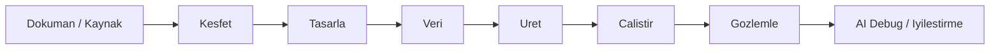

# BGTS Kullanim Kurgulari Sunumu

## Slayt 1 - Amac

Bu sunumun amaci, BGTS icindeki tum ana yetenekleri:

- test yonetimi
- AI destekli test tasarimi
- otomasyon uretimi
- servis ve UI kosulari
- sentetik veri
- raporlama ve analiz

tek bir urun deneyiminde en dogru sekilde nasil birlestirebilecegimizi gostermektir.

## Slayt 2 - Bugunku Durum

Platform guclu ama kullanimda yogun:

- cok fazla ekran var
- benzer isler farkli giris noktalarina dagiliyor
- kullanici modul secmek zorunda kaliyor
- AI bazi yerlerde yardimci, bazi yerlerde ayri bir urun gibi duruyor

Bu nedenle odak soru su:

`Kullanici tum ozellikleri kaybetmeden en kolay nasil ilerler?`

## Slayt 3 - Degerlendirme Kriterleri

10 kullanim kurgusunu su kriterlerle degerlendirdim:

1. Demo icin anlatilabilirlik
2. Yeni kullanici icin anlasilabilirlik
3. Tum modulleri kapsama gucu
4. Gelistirme maliyeti
5. Kurumsal ekiplerde benimsenme ihtimali
6. AI'nin urune dogal yerlestirilebilmesi

## Slayt 4 - Mevcut Yetenek Havuzu

Asagidaki alanlar korunmak zorunda:

- `Import / Requirements / Coverage / Analysis`
- `Scenarios / Test Cases / Approvals / Workflows`
- `Synthetic / Test Data`
- `Manual / Manual-to-Automation / Automation / Automation Gen / Recorder / Page Objects / Locators`
- `API Tests / Executions / Runs / Regression / Schedules / CI-CD / Integrations`
- `Reports / Analytics / Debug Report / Flaky / Visual / Accessibility / Monkey`
- `AI Chat`

## Slayt 5 - Kurgu 1: Akis Bazli Tasarim

### Ozet

Kullanici modul degil surec takip eder.

### Ana Menu

- Kesfet
- Tasarla
- Veri
- Uret
- Calistir
- Gozlemle

### Guclu Yonu

- en anlasilir model
- demo icin en guclu hikaye
- tum modulleri tek yasam dongusunde toplar

### Zayif Yonu

- uzman kullanici bazen direkt belirli bir araca gitmek isteyebilir

### Skor

- `9.5/10`

## Slayt 6 - Kurgu 2: Hub Bazli Tasarim

### Ozet

Urun 6 buyuk merkeze ayrilir:

- Spec Hub
- Test Hub
- Data Hub
- Automation Hub
- Execution Hub
- Insight Hub

### Guclu Yonu

- ekip sahipligi net olur
- buyuk urunlerde olgun gorunur

### Zayif Yonu

- kullanici hala modul secmek zorundadir
- demo akisi kadar rehberli degildir

### Skor

- `8.3/10`

## Slayt 7 - Kurgu 3: Rol Bazli Tasarim

### Ozet

Arayuz kullanici rolune gore degisir:

- Analist
- QA Tasarimci
- Otomasyon Muhendisi
- TestOps / Lead

### Guclu Yonu

- karar yukunu ciddi azaltir
- buyuk ekiplerde verimli olur

### Zayif Yonu

- urunun tam gucunu gizleyebilir
- erken asamada fazla segmentasyon yaratir

### Skor

- `7.8/10`

## Slayt 8 - Kurgu 4: AI Gorev Merkezi

### Ozet

Ana ekran kullaniciya su soruyu sorar:

`Bugun ne yapmak istiyorsun?`

Sonra AI kullaniciyi goreve gore yonlendirir:

- dokumandan test cikar
- API servis testi kur
- sentetik veri uret
- otomasyon uret
- hata analiz et

### Guclu Yonu

- fark yaratan urun algisi yaratir
- AI gercekten merkeze gelir

### Zayif Yonu

- orkestrasyon gelistirmesi zordur
- arka tarafta guclu durum yonetimi ister

### Skor

- `8.9/10`

## Slayt 9 - Kurgu 5: Pipeline Board

### Ozet

Tum urun bir kanban/pipeline board gibi gorunur:

- Imported
- Drafted
- Approved
- Data Ready
- Automated
- Running
- Reported

### Guclu Yonu

- durum takibi cok gucludur
- ekip koordinasyonu kolaylasir

### Zayif Yonu

- butun ekranlari pipeline kartina cevirmek zaman alir
- veri ve analiz modulleri biraz zorlama hissedebilir

### Skor

- `8.1/10`

## Slayt 10 - Kurgu 6: Workspace Bazli Tasarim

### Ozet

Her buyuk ihtiyac icin ayri calisma alani olur:

- Test Workspace
- Data Workspace
- Automation Workspace
- API Workspace
- Insight Workspace

### Guclu Yonu

- guclu kullanicilar icin temiz ayrisim
- buyuk urun genislemesine uygun

### Zayif Yonu

- yeni kullanici icin fazla kurumsal ve soguk olabilir
- demo anlatiminda gereksiz agirlik yaratir

### Skor

- `7.5/10`

## Slayt 11 - Kurgu 7: Persona + Akis Hibridi

### Ozet

Urunun ana yapisi akis bazli kalir ama ekran icerigi role gore hafif sekilde degisir.

Ornek:

- ayni `Tasarla` menusu
- analiste `requirements` ve `approvals` one cikar
- otomasyoncuya `automation-gen` ve `locators` one cikar

### Guclu Yonu

- hem sade hem esnek
- gelecekte RBAC ile guclenir

### Zayif Yonu

- ilk fazda gereksiz kosulluluk yaratabilir

### Skor

- `9.1/10`

## Slayt 12 - Kurgu 8: Dashboard + Derinlik Modeli

### Ozet

Sadece ana dashboard tamamen yeniden dusunulur; diger sayfalar ayni kalir.

Ana dashboard:

- sonraki adim onerisi
- 6 akis karti
- proje saglik skoru
- hizli aksiyonlar

### Guclu Yonu

- en hizli uygulanabilir model
- mevcut yapinin ustune oturur

### Zayif Yonu

- derindeki bilgi mimarisi karisik kalmaya devam eder

### Skor

- `8.4/10`

## Slayt 13 - Kurgu 9: Command Center

### Ozet

Tum urun ustte bir global komut cubugu ile kullanilir.

Kullanici su gibi komutlar verir:

- `kredi basvuru senaryolari getir`
- `API koleksiyonu import et`
- `sentetik veri uret`
- `son failed run'i analiz et`

### Guclu Yonu

- guclu kullanici deneyimi sunar
- AI ile cok iyi uyusur

### Zayif Yonu

- tek basina ana navigasyon yerine gecemez
- kesfedilebilirlik dusuk olabilir

### Skor

- `7.9/10`

## Slayt 14 - Kurgu 10: Demo Story Mode

### Ozet

Urun icinde secilebilir bir demo modu olur.

Tek akista sunar:

1. dokuman yukle
2. requirement cikar
3. senaryo olustur
4. sentetik veri bagla
5. otomasyon uret
6. kosu baslat
7. rapor ve AI debug goster

### Guclu Yonu

- satis ve demo icin cok etkilidir
- urunun degerini hizli anlatir

### Zayif Yonu

- gunluk kullanim yapisinin yerine gecmez
- urun ici ozel mod ister

### Skor

- `8.7/10`

## Slayt 15 - Karsilastirma Ozeti

| Kurgu | Skor | En Dogru Kullanim |
|------|------|-------------------|
| 1. Akis Bazli | 9.5 | Ana urun mimarisi |
| 2. Hub Bazli | 8.3 | Kurumsal olgunlasma |
| 3. Rol Bazli | 7.8 | Buyuk ekipler |
| 4. AI Gorev Merkezi | 8.9 | Farklilasma ve AI vitrin |
| 5. Pipeline Board | 8.1 | Operasyon takip |
| 6. Workspace Bazli | 7.5 | Ileri seviye modularizasyon |
| 7. Persona + Akis Hibridi | 9.1 | Faz 2 olgunlasma |
| 8. Dashboard + Derinlik | 8.4 | Hizli kazanım |
| 9. Command Center | 7.9 | Power-user ek katman |
| 10. Demo Story Mode | 8.7 | Satis ve sunum modu |

## Slayt 16 - En Uygun Kurgu

Bugun bu proje icin en dogru karar:

`Kurgu 1: Akis Bazli Tasarim`

ve onun ustune:

`Kurgu 4: AI Gorev Merkezi`

### Neden?

- mevcut karmasayi en cok bu azaltir
- tum modulleri tek hikayede birlestirir
- demo ve gercek kullanim ayni iskeleti kullanabilir
- AI urune sonradan eklenmis degil, yonlendirici katman gibi hissedilir

## Slayt 17 - Onerilen Nihai Model

### Temel Mimari

- Sol menu: `Kesfet`, `Tasarla`, `Veri`, `Uret`, `Calistir`, `Gozlemle`
- Proje ana sayfasi: `Akis Merkezi`
- Sag panel / yardimci cekmece: `AI Copilot`

### Yardimci Katmanlar

- `AI Gorev Merkezi` ana giriste
- `Demo Story Mode` satis sunumlari icin
- `Persona + Akis Hibridi` faz 2'de

## Slayt 18 - Ornek Nihai Kullanici Akisi

## Slayt 19 - Uygulama Plani

### Faz 1

- sidebar'i akis bazli hale getir
- proje dashboard'unu `Akis Merkezi`ne cevir
- her akis icin hizli giris kartlari ekle

### Faz 2

- AI Gorev Merkezi ekle
- sag panel copilot modeli getir
- kullaniciya bir sonraki adimi her ekranda goster

### Faz 3

- role gore hafif kisisellestirme
- demo story mode
- command center

## Slayt 20 - Net Karar Onerisi

Toplanti karari icin benim net onerim:

1. Urunun ana yapisi `Akis Bazli` olsun.
2. Giris deneyimi `Akis Merkezi` olarak yeniden kurgulansin.
3. AI ayri sayfa degil, tum akislarin yardimcisi olsun.
4. Demo sunumlari icin ayrica `Story Mode` eklensin.
5. Rol bazli farklilastirma daha sonra gelsin.

## Ek Not

Bu karar, mevcut repo yapisina gore en dusuk karmasa / en yuksek etki oranini verir.
