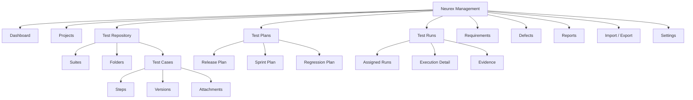
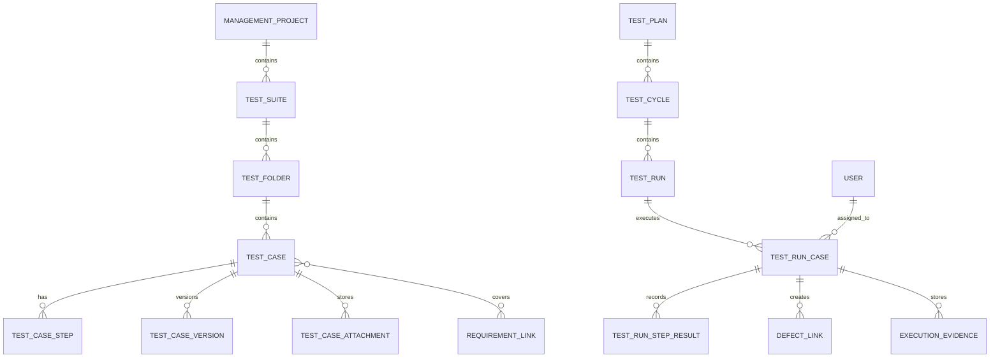

# Neurex Management - Manuel Test Yönetimi İskelet Planı

## Amaç

`Neurex Management`, Neurex ürün ailesi içinde manuel testleri, test ekiplerini, test koşumlarını, kanıtları ve kalite kararlarını yönetecek ayrı bir yönetim alanı olarak konumlanır. `Neurex Mobile` nasıl mobil test operasyonunu temsil ediyorsa, `Neurex Management` da tüm manuel QA operasyonunun merkezi olur.

İlk hedef, manuel testlerin eksiksiz saklanabildiği, aranabildiği, versiyonlanabildiği, koşulabildiği ve raporlanabildiği sağlam bir iskelet kurmaktır. Otomasyon, AI test üretimi ve ileri entegrasyonlar bu temel üzerine sonradan eklenir.

## Ürün Konumlandırması

| Alan | Karar |
|------|-------|
| Ürün adı | Neurex Management |
| Ana odak | Manuel test yönetimi, test case havuzu, test run/cycle yönetimi, kalite raporlama |
| İlk kullanıcılar | QA Lead, Manual Tester, Test Manager, Product Owner, Developer Viewer |
| İlk menü konumu | Global ürün navigasyonu altında `Management` |
| İlk route önerisi | `/management` ve proje içi `/management/projects/[projectId]/*` |
| Backend domain önerisi | `backend/app/domains/test_management` |
| API prefix önerisi | `/api/v1/test-management/*` |

## Mimari Eksikler ve Tamamlama Kararı

Bu planın mimariye bağlanması için kapatılması gereken ana boşluklar:

| Eksik | Karar |
|-------|-------|
| Ürün registry | `@neurex/product-management` paketi ayrı ürün manifest'i olarak eklenir. |
| Route katalogu | `management-*` route key'leri merkezi product-kit kataloguna eklenir. |
| TSPM sınırı | `tspm` senaryo/AI/akış süreçlerinde kalır; `test_management` manuel test operasyonunun kaynağı olur. |
| Backend domain | `backend/app/domains/test_management` domain'i ayrı servis, schema, repository ve reporting modülleriyle kurulur. |
| Artifact bağlantısı | Execution evidence dosyaları mevcut `artifacts` domain'i ve storage yaklaşımıyla ilişkilendirilir. |
| RBAC | Management rolleri mevcut auth/RBAC katmanına yeni policy olarak eklenir. |
| Import/export | Excel/CSV import staging ve rollback log'u domain içinde ayrı servis olarak ele alınır. |

## Kapsam İlkesi

İlk iskelet, manuel test verisinin kaybolmadan, dağılmadan ve tekrar kullanılabilir şekilde tutulmasına odaklanır.

Kapsamda:

- Test case repository
- Test suite ve klasör yapısı
- Test case adımları
- Ön koşullar, test verisi, beklenen sonuçlar
- Test planı, test cycle, test run
- Tester atama ve durum takibi
- Actual result, yorum, attachment, ekran görüntüsü
- Defect linkleme
- Requirement/story linkleme
- Import/export
- Versiyonlama ve audit izi
- Dashboard ve raporlama iskeleti

İlk faz dışında:

- Otomatik test çalıştırma
- AI ile test case üretimi
- Exploratory session recorder
- Gelişmiş risk skorlama
- Çoklu CI/CD result ingestion

Bu alanlar veri modeli kırılmadan eklenebilecek şekilde planlanır.

## Bilgi Mimarisi



## Global Menü

Neurex ürün ailesi içinde önerilen üst navigasyon:

1. `One`
2. `Studio`
3. `Service`
4. `Web`
5. `Mobile`
6. `Data`
7. `Management`
8. `Intelligence`

`Management`, test liderinin günlük operasyon merkezidir. `Studio` test tasarımına ve AI destekli senaryo üretimine daha yakın kalırken, `Management` gerçek manuel test operasyonunu, sorumlulukları ve koşum geçmişini yönetir.

## Ürün İçi Menü

| Menü | Amaç | İlk faz |
|------|------|---------|
| Dashboard | Genel kalite durumu, aktif koşumlar, tester iş yükü | Evet |
| Projects | Management kapsamındaki test projeleri | Evet |
| Test Repository | Kalıcı manuel test case havuzu | Evet |
| Test Plans | Release/sprint/regression test planları | Evet |
| Test Runs | Tester bazlı yürütme ekranı | Evet |
| Requirements | Story/requirement bağlantıları | Evet, temel |
| Defects | Fail edilen testlerden defect bağlama | Evet, temel |
| Reports | Coverage, execution, defect ve workload raporları | Evet |
| Import / Export | Excel/CSV içe aktarma ve dışa aktarma | Evet |
| Settings | Durumlar, öncelikler, alanlar, roller | Evet |
| AI Assist | Test case önerisi, duplicate bulma, coverage gap | Faz 2 |
| Automation Sync | Otomasyon test sonucu bağlama | Faz 2 |
| Exploratory | Session based test notları ve kanıt | Faz 2 |

## Route İskeleti

| Ekran | Route | Açıklama |
|-------|-------|----------|
| Management ana sayfa | `/management` | Ürün ana dashboard |
| Proje listesi | `/management/projects` | Test yönetimi projeleri |
| Proje dashboard | `/management/projects/[projectId]` | KPI, son aktiviteler, açık koşumlar |
| Repository | `/management/projects/[projectId]/repository` | Suite/folder/test case ağacı |
| Test case detay | `/management/projects/[projectId]/cases/[caseId]` | Case metadata, steps, versions, history |
| Test case oluştur | `/management/projects/[projectId]/cases/new` | Manuel test case formu |
| Test planları | `/management/projects/[projectId]/plans` | Release/sprint/regression planları |
| Test plan detay | `/management/projects/[projectId]/plans/[planId]` | Plan kapsamı ve seçili testler |
| Test run listesi | `/management/projects/[projectId]/runs` | Aktif, tamamlanan, planlanan koşumlar |
| Test run yürütme | `/management/projects/[projectId]/runs/[runId]/execute` | Tester çalışma ekranı |
| Requirements | `/management/projects/[projectId]/requirements` | Requirement/story listesi ve coverage |
| Defects | `/management/projects/[projectId]/defects` | Fail result ve defect bağlantıları |
| Reports | `/management/projects/[projectId]/reports` | Rapor merkezi |
| Import | `/management/projects/[projectId]/import` | Excel/CSV mapping ve önizleme |
| Settings | `/management/projects/[projectId]/settings` | Workflow, alanlar, roller |

## Ana Veri Modeli

### Entity Haritası



### Management Project

| Alan | Tip | Not |
|------|-----|-----|
| `id` | UUID | Ana kayıt |
| `workspace_id` | UUID | Multi-tenant yapı |
| `name` | string | Proje adı |
| `key` | string | Kısa kod, örn. `CRM`, `MOBILE` |
| `description` | text | Opsiyonel |
| `status` | enum | active, archived |
| `created_by` | UUID | Kullanıcı |
| `created_at`, `updated_at` | datetime | Audit |

### Test Suite

| Alan | Tip | Not |
|------|-----|-----|
| `id` | UUID | Ana kayıt |
| `project_id` | UUID | Bağlı proje |
| `name` | string | Örn. Login, Payment, Customer |
| `description` | text | Opsiyonel |
| `order_index` | integer | Sıralama |
| `status` | enum | active, archived |

### Test Folder

| Alan | Tip | Not |
|------|-----|-----|
| `id` | UUID | Ana kayıt |
| `suite_id` | UUID | Bağlı suite |
| `parent_id` | UUID/null | İç içe klasör |
| `name` | string | Klasör adı |
| `path` | string | Hızlı arama için materialized path |
| `order_index` | integer | Sıralama |

### Test Case

| Alan | Tip | Not |
|------|-----|-----|
| `id` | UUID | Ana kayıt |
| `case_key` | string | İnsan okunur kod, örn. `TC-1024` |
| `project_id` | UUID | Bağlı proje |
| `suite_id` | UUID | Bağlı suite |
| `folder_id` | UUID/null | Bağlı klasör |
| `title` | string | Test başlığı |
| `objective` | text | Testin amacı |
| `preconditions` | text | Ön koşullar |
| `test_data` | jsonb | Kullanılacak veri |
| `priority` | enum | low, medium, high, critical |
| `severity` | enum | minor, major, critical |
| `type` | enum | functional, regression, smoke, sanity, usability, security |
| `automation_status` | enum | manual, candidate, automated, deprecated |
| `status` | enum | draft, ready, needs_review, deprecated, archived |
| `owner_id` | UUID/null | Sorumlu kişi |
| `tags` | string[] | Arama ve filtre |
| `custom_fields` | jsonb | Müşteriye özel alanlar |
| `current_version` | integer | Aktif versiyon |
| `created_by`, `updated_by` | UUID | Audit |
| `created_at`, `updated_at` | datetime | Audit |

### Test Case Step

| Alan | Tip | Not |
|------|-----|-----|
| `id` | UUID | Ana kayıt |
| `case_id` | UUID | Bağlı test case |
| `step_no` | integer | Adım sırası |
| `action` | text | Yapılacak işlem |
| `expected_result` | text | Beklenen sonuç |
| `test_data` | jsonb | Adım bazlı veri |
| `notes` | text | Opsiyonel |
| `is_required` | boolean | Atlanabilir/adım zorunlu |

### Test Case Version

| Alan | Tip | Not |
|------|-----|-----|
| `id` | UUID | Ana kayıt |
| `case_id` | UUID | Bağlı test case |
| `version_no` | integer | Versiyon numarası |
| `snapshot` | jsonb | Case + steps tam snapshot |
| `change_summary` | text | Değişiklik özeti |
| `created_by` | UUID | Kim versiyonladı |
| `created_at` | datetime | Ne zaman |

### Test Plan

| Alan | Tip | Not |
|------|-----|-----|
| `id` | UUID | Ana kayıt |
| `project_id` | UUID | Bağlı proje |
| `name` | string | Örn. Sprint 12 Regression |
| `plan_type` | enum | release, sprint, regression, hotfix, uat |
| `release_name` | string/null | Release bağlantısı |
| `start_date`, `end_date` | date | Plan aralığı |
| `status` | enum | draft, active, completed, archived |
| `scope_summary` | text | Plan kapsamı |
| `created_by` | UUID | Audit |

### Test Cycle

| Alan | Tip | Not |
|------|-----|-----|
| `id` | UUID | Ana kayıt |
| `plan_id` | UUID | Bağlı plan |
| `name` | string | Örn. Cycle 1, Retest Cycle |
| `environment` | string | QA, Staging, Prod-like |
| `build_version` | string | Uygulama build/release |
| `status` | enum | planned, running, completed, cancelled |

### Test Run

| Alan | Tip | Not |
|------|-----|-----|
| `id` | UUID | Ana kayıt |
| `cycle_id` | UUID | Bağlı cycle |
| `name` | string | Run adı |
| `assigned_group_id` | UUID/null | Takım |
| `status` | enum | not_started, in_progress, completed, blocked |
| `started_at`, `completed_at` | datetime/null | Zaman bilgisi |

### Test Run Case

| Alan | Tip | Not |
|------|-----|-----|
| `id` | UUID | Ana kayıt |
| `run_id` | UUID | Bağlı run |
| `case_id` | UUID | Bağlı case |
| `case_version_no` | integer | Koşulan versiyon sabitlenir |
| `assigned_to` | UUID/null | Tester |
| `status` | enum | not_run, passed, failed, blocked, skipped, retest |
| `actual_result` | text | Genel sonuç |
| `execution_notes` | text | Tester notu |
| `started_at`, `completed_at` | datetime/null | Süre |
| `duration_seconds` | integer/null | Koşum süresi |

### Test Run Step Result

| Alan | Tip | Not |
|------|-----|-----|
| `id` | UUID | Ana kayıt |
| `run_case_id` | UUID | Bağlı run case |
| `step_no` | integer | Case step ile eşleşir |
| `status` | enum | passed, failed, blocked, skipped |
| `actual_result` | text | Adım bazlı gerçek sonuç |
| `comment` | text | Tester yorumu |
| `evidence_count` | integer | Ek dosya sayısı |

### Execution Evidence

| Alan | Tip | Not |
|------|-----|-----|
| `id` | UUID | Ana kayıt |
| `run_case_id` | UUID | Bağlı run case |
| `step_result_id` | UUID/null | Adım bazlı kanıt |
| `artifact_id` | UUID/null | Mevcut artifact domain ile bağlanabilir |
| `file_name` | string | Dosya adı |
| `file_type` | enum | screenshot, video, log, document, other |
| `storage_url` | string | MinIO/local artifact yolu |
| `uploaded_by` | UUID | Kullanıcı |
| `uploaded_at` | datetime | Zaman |

### Requirement Link

| Alan | Tip | Not |
|------|-----|-----|
| `id` | UUID | Ana kayıt |
| `project_id` | UUID | Proje |
| `external_source` | enum | jira, azure_devops, github, internal |
| `external_key` | string | Story/requirement id |
| `title` | string | Gereksinim başlığı |
| `url` | string/null | Dış sistem linki |
| `case_id` | UUID | Kapsayan test case |
| `coverage_status` | enum | covered, partial, missing, stale |

### Defect Link

| Alan | Tip | Not |
|------|-----|-----|
| `id` | UUID | Ana kayıt |
| `run_case_id` | UUID | Fail edilen koşum |
| `step_result_id` | UUID/null | Adım bağlantısı |
| `external_source` | enum | jira, azure_devops, github, internal |
| `external_key` | string | Bug id |
| `title` | string | Bug başlığı |
| `status` | string | Dış sistemden senkron durum |
| `url` | string/null | Link |

## Manuel Test Saklama Standardı

Her manuel test case minimum şu bilgileri taşımalıdır:

| Alan | Zorunlu | Açıklama |
|------|---------|----------|
| Başlık | Evet | Kısa, davranış odaklı |
| Modül/suite | Evet | Hangi ürün alanını test ediyor |
| Öncelik | Evet | İş etkisi |
| Tip | Evet | Smoke, regression, functional vb. |
| Ön koşul | Evet | Test başlamadan önce gereken durum |
| Test adımları | Evet | Sıralı aksiyonlar |
| Beklenen sonuç | Evet | Her adım veya case seviyesinde |
| Test verisi | Önerilir | Kullanıcı, hesap, ürün, ortam verisi |
| Requirement link | Önerilir | Coverage için |
| Etiketler | Önerilir | Arama, regresyon seti, modül ayrımı |
| Kanıt politikası | Önerilir | Hangi durumda ekran görüntüsü/log gerekir |

## Test Case Durumları

| Durum | Anlam |
|-------|-------|
| `draft` | Henüz tamamlanmamış test |
| `needs_review` | Lead onayı bekliyor |
| `ready` | Koşulabilir test |
| `deprecated` | Artık kullanılmıyor ama geçmiş için saklanıyor |
| `archived` | Aktif listeden kaldırılmış |

## Test Run Durumları

| Durum | Anlam |
|-------|-------|
| `not_run` | Henüz koşulmadı |
| `passed` | Başarılı |
| `failed` | Hata bulundu |
| `blocked` | Dış engel nedeniyle tamamlanamadı |
| `skipped` | Bilerek atlandı |
| `retest` | Bug fix sonrası tekrar koşulmalı |

## Ekran İskeletleri

### 1. Management Dashboard

KPI alanları:

- Aktif test planı sayısı
- Bugün atanmış testler
- Passed / Failed / Blocked dağılımı
- Requirement coverage yüzdesi
- Kritik failed test sayısı
- Tester bazlı iş yükü
- En riskli modüller

Ana tablolar:

- Devam eden test run'lar
- Geciken atamalar
- Son failed testler
- Coverage eksiği olan requirements
- Son değişen test case'ler

### 2. Test Repository

Sol panel:

- Suite/folder ağacı
- Arama
- Etiket filtresi
- Tip, öncelik, status filtresi

Orta alan:

- Test case listesi
- Case key
- Başlık
- Öncelik
- Tip
- Son güncelleme
- Automation status
- Son run sonucu

Sağ panel:

- Seçili test case hızlı özeti
- Adım sayısı
- Requirement linkleri
- Son 5 koşum sonucu
- Hızlı aksiyonlar: edit, clone, add to plan, archive

### 3. Test Case Detay

Sekmeler:

- Overview
- Steps
- Requirements
- Runs
- Defects
- Attachments
- Versions
- Audit

Overview alanları:

- Başlık, açıklama, amaç
- Ön koşullar
- Test verisi
- Priority/severity/type/status
- Owner ve tags
- Custom fields

Steps tablosu:

- No
- Action
- Expected result
- Test data
- Notes

### 4. Test Plan Builder

Akış:

1. Plan adı ve tipi seçilir.
2. Release/sprint/build bilgisi girilir.
3. Repository'den test case'ler filtrelenir.
4. Test case'ler plana eklenir.
5. Cycle oluşturulur.
6. Tester ataması yapılır.
7. Plan active durumuna alınır.

Filtreler:

- Suite/folder
- Priority
- Tag
- Requirement
- Son failed olanlar
- Son X gündür koşulmayanlar
- Regression/smoke adayları

### 5. Test Run Execute

Tester odaklı ekran:

- Sol: atanmış test case listesi
- Orta: aktif test adımı
- Sağ: context paneli

Aktif adımda:

- Action
- Expected result
- Test data
- Pass / Fail / Block / Skip butonları
- Actual result alanı
- Comment alanı
- Screenshot/log/document upload
- Defect oluştur/linkle

Alt alan:

- Önceki/sonraki adım
- Testi pause et
- Tüm case'i failed/passed olarak işaretle
- Retest notu ekle

### 6. Reports

İlk raporlar:

- Execution Summary
- Requirement Coverage Matrix
- Test Case Aging
- Failed Tests by Module
- Blocked Tests
- Tester Workload
- Defect Leakage
- Regression Readiness
- Release GO/NO-GO Summary

## Import / Export Planı

### Excel Import Kolonları

| Kolon | Zorunlu | Eşleşen alan |
|-------|---------|--------------|
| Suite | Evet | `test_suite.name` |
| Folder | Hayır | `test_folder.path` |
| Case Key | Hayır | `test_case.case_key` |
| Title | Evet | `test_case.title` |
| Objective | Hayır | `test_case.objective` |
| Preconditions | Hayır | `test_case.preconditions` |
| Priority | Evet | `test_case.priority` |
| Type | Evet | `test_case.type` |
| Tags | Hayır | `test_case.tags` |
| Step No | Evet | `test_case_step.step_no` |
| Action | Evet | `test_case_step.action` |
| Expected Result | Evet | `test_case_step.expected_result` |
| Test Data | Hayır | `test_case_step.test_data` |
| Requirement Key | Hayır | `requirement_link.external_key` |

### Import Akışı

1. Dosya yüklenir.
2. Sistem kolonları otomatik eşleştirmeye çalışır.
3. Kullanıcı mapping ekranında düzeltir.
4. Önizleme oluşturulur.
5. Hatalar satır bazlı gösterilir.
6. Geçerli kayıtlar staging alana alınır.
7. Kullanıcı onaylar.
8. Test case'ler ve adımlar repository'ye yazılır.
9. Import log ve rollback noktası saklanır.

### Export Formatları

- Repository export: Excel/CSV
- Test plan export: Excel/PDF
- Execution report: Excel/PDF
- Requirement coverage matrix: Excel
- Audit export: CSV

## API İskeleti

```text
GET    /api/v1/test-management/projects
POST   /api/v1/test-management/projects
GET    /api/v1/test-management/projects/{project_id}

GET    /api/v1/test-management/projects/{project_id}/repository
GET    /api/v1/test-management/projects/{project_id}/suites
POST   /api/v1/test-management/projects/{project_id}/suites
POST   /api/v1/test-management/projects/{project_id}/folders

GET    /api/v1/test-management/projects/{project_id}/cases
POST   /api/v1/test-management/projects/{project_id}/cases
GET    /api/v1/test-management/projects/{project_id}/cases/{case_id}
PATCH  /api/v1/test-management/projects/{project_id}/cases/{case_id}
POST   /api/v1/test-management/projects/{project_id}/cases/{case_id}/clone
POST   /api/v1/test-management/projects/{project_id}/cases/{case_id}/archive
GET    /api/v1/test-management/projects/{project_id}/cases/{case_id}/versions

GET    /api/v1/test-management/projects/{project_id}/plans
POST   /api/v1/test-management/projects/{project_id}/plans
GET    /api/v1/test-management/projects/{project_id}/plans/{plan_id}
POST   /api/v1/test-management/projects/{project_id}/plans/{plan_id}/cycles

GET    /api/v1/test-management/projects/{project_id}/runs
POST   /api/v1/test-management/projects/{project_id}/runs
GET    /api/v1/test-management/projects/{project_id}/runs/{run_id}
POST   /api/v1/test-management/projects/{project_id}/runs/{run_id}/assign
PATCH  /api/v1/test-management/projects/{project_id}/run-cases/{run_case_id}
PATCH  /api/v1/test-management/projects/{project_id}/run-cases/{run_case_id}/steps/{step_result_id}
POST   /api/v1/test-management/projects/{project_id}/run-cases/{run_case_id}/evidence
POST   /api/v1/test-management/projects/{project_id}/run-cases/{run_case_id}/defects

GET    /api/v1/test-management/projects/{project_id}/requirements
POST   /api/v1/test-management/projects/{project_id}/requirements/link
GET    /api/v1/test-management/projects/{project_id}/reports/execution-summary
GET    /api/v1/test-management/projects/{project_id}/reports/coverage-matrix
GET    /api/v1/test-management/projects/{project_id}/reports/workload

POST   /api/v1/test-management/projects/{project_id}/imports
GET    /api/v1/test-management/projects/{project_id}/imports/{import_id}
POST   /api/v1/test-management/projects/{project_id}/exports
```

## Frontend Paket İskeleti

Önerilen yeni paket:

```text
packages/product-management/
├── package.json
├── src/
│   ├── index.ts
│   ├── types.ts
│   ├── mock-data.ts
│   ├── navigation.ts
│   ├── components/
│   │   ├── ManagementDashboard.tsx
│   │   ├── RepositoryTree.tsx
│   │   ├── TestCaseTable.tsx
│   │   ├── TestCaseDetail.tsx
│   │   ├── TestPlanBuilder.tsx
│   │   ├── TestRunExecutor.tsx
│   │   ├── CoverageMatrix.tsx
│   │   └── ImportMapping.tsx
│   └── data/
│       ├── status.ts
│       ├── priorities.ts
│       └── report-presets.ts
```

Önerilen Next.js route klasörü:

```text
apps/web/app/(dashboard)/management/
├── page.tsx
├── projects/page.tsx
├── projects/[projectId]/page.tsx
├── projects/[projectId]/repository/page.tsx
├── projects/[projectId]/cases/[caseId]/page.tsx
├── projects/[projectId]/cases/new/page.tsx
├── projects/[projectId]/plans/page.tsx
├── projects/[projectId]/plans/[planId]/page.tsx
├── projects/[projectId]/runs/page.tsx
├── projects/[projectId]/runs/[runId]/execute/page.tsx
├── projects/[projectId]/requirements/page.tsx
├── projects/[projectId]/defects/page.tsx
├── projects/[projectId]/reports/page.tsx
├── projects/[projectId]/import/page.tsx
└── projects/[projectId]/settings/page.tsx
```

## Backend Modül İskeleti

```text
backend/app/domains/test_management/
├── __init__.py
├── models.py
├── schemas.py
├── router.py
├── service.py
├── repository.py
├── permissions.py
├── import_export.py
├── reporting.py
├── audit.py
└── tests/
    ├── test_cases_api_test.py
    ├── test_runs_api_test.py
    ├── test_import_export_test.py
    └── test_reports_test.py
```

## Yetki Modeli

| Rol | Yetkiler |
|-----|----------|
| Management Admin | Tüm proje ayarları, roller, silme/arşivleme |
| QA Lead | Test case, plan, run, atama, rapor, import/export |
| Manual Tester | Kendisine atanmış run'ları yürütme, evidence yükleme, defect linkleme |
| Developer Viewer | Test sonuçlarını, failed test ve defect linklerini görüntüleme |
| Product Viewer | Dashboard, coverage ve release raporlarını görüntüleme |
| Auditor | Audit, versions ve execution evidence görüntüleme |

## Dashboard KPI Tanımları

| KPI | Hesap |
|-----|------|
| Pass rate | `passed / executed` |
| Execution progress | `(passed + failed + blocked + skipped) / total assigned` |
| Blocked rate | `blocked / total assigned` |
| Requirement coverage | `covered requirements / total requirements` |
| Critical fail count | `failed where priority = critical` |
| Retest queue | `run_case.status = retest` |
| Stale test cases | `last_run_at older than threshold` |
| Tester workload | `not_run + in_progress assigned by user` |

## Fazlandırma

### Faz 0 - Ürün İskeleti

- `Management` ürün menüsü tanımlanır.
- Mock veri ile dashboard, repository, run ekranı prototiplenir.
- Route yapısı kurulur.
- Veri modeli migration taslağı çıkarılır.
- Import Excel şablonu hazırlanır.

Çıkış kriteri:

- Kullanıcı `Management` alanına girip örnek manuel testleri görebilir.
- Test case detayında adımlar ve expected result okunabilir.
- Test run execute ekranı mock veriyle çalışır.

### Faz 1 - Kalıcı Manuel Test Havuzu

- Backend CRUD endpoint'leri yazılır.
- Test suite/folder/case/step tabloları eklenir.
- Versiyon snapshot mekanizması eklenir.
- Repository arama/filtreleme yapılır.
- Excel import/export ilk sürüm tamamlanır.

Çıkış kriteri:

- Manuel testler kalıcı olarak saklanır.
- Excel'den toplu test case aktarılır.
- Test case düzenlendiğinde eski versiyon korunur.

### Faz 2 - Test Plan ve Run

- Test plan/cycle/run tabloları eklenir.
- Test case'ler plana seçilerek run oluşturulur.
- Tester ataması yapılır.
- Tester execute ekranında adım bazlı sonuç girer.
- Evidence upload ve defect linkleme yapılır.

Çıkış kriteri:

- QA lead bir regression run oluşturup tester'lara atayabilir.
- Tester adım adım çalışıp sonucu kaydedebilir.
- Failed test için defect linklenebilir.

### Faz 3 - Traceability ve Reports

- Requirement linkleri eklenir.
- Coverage matrix çıkarılır.
- Execution summary, workload, failed by module raporları eklenir.
- Release GO/NO-GO özeti oluşturulur.

Çıkış kriteri:

- Bir requirement'ın hangi testlerle kapsandığı görülebilir.
- Bir release için test tamamlanma ve risk durumu raporlanır.

### Faz 4 - AI ve Automation Genişleme

- Requirement/story'den test case önerisi.
- Duplicate test case tespiti.
- Coverage gap önerileri.
- Playwright/Cypress/JUnit sonuçlarını case ile eşleme.
- Manual-to-automation aday listesi.

Çıkış kriteri:

- AI test case taslağı üretir ama kullanıcı onaylamadan repository'ye yazmaz.
- Otomasyon sonuçları manuel test havuzu ile aynı dashboard'da görülebilir.

## MVP Kabul Kriterleri

- QA Lead yeni bir Management projesi açabilir.
- Suite/folder altında manuel test case oluşturabilir.
- Test case'e birden fazla adım ve expected result ekleyebilir.
- Test case'i düzenlediğinde eski versiyon saklanır.
- Excel'den test case import edebilir.
- Test plan oluşturup case seçebilir.
- Run oluşturup tester atayabilir.
- Tester kendisine atanan testi adım adım koşabilir.
- Her adım için actual result ve evidence ekleyebilir.
- Failed testten defect linkleyebilir.
- Dashboard pass/fail/blocked ve workload gösterebilir.
- Coverage matrix requirement linklerine göre temel rapor verebilir.

## Açık Tasarım Kararları

| Karar | Öneri |
|-------|-------|
| Test case silme | Fiziksel silme yerine archive |
| Versiyonlama | Her meaningful update sonrası JSON snapshot |
| Case key üretimi | Proje prefix + otomatik sıra, örn. `CRM-TC-1001` |
| Evidence storage | Mevcut artifacts/MinIO yaklaşımıyla uyumlu |
| Requirement source | İlk sürüm internal + manuel external key; sonra Jira/Azure sync |
| Defect source | İlk sürüm linkleme; sonra API ile create/update |
| Custom fields | `jsonb` ile başlat, sonradan field schema ekle |
| Multi-tenant | Workspace/project scope zorunlu |

## İlk Teknik İş Listesi

1. `packages/product-management` paketini oluştur.
2. `apps/web/app/(dashboard)/management` route ağacını kur.
3. Mock veriyle dashboard, repository ve run executor ekranlarını çıkar.
4. Backend `test_management` domain klasörünü aç.
5. SQLAlchemy model ve Alembic migration taslağını ekle.
6. Test case CRUD endpoint'lerini yaz.
7. Excel import şablonunu ve mapping ekranını tasarla.
8. Test plan/run endpoint'lerini ekle.
9. Execution result ve evidence akışını bağla.
10. Coverage/report endpoint'lerini çıkar.

## Riskler

| Risk | Önlem |
|------|-------|
| Test case alanları hızla şişebilir | Core alan + custom fields ayrımı |
| Excel import karmaşıklaşabilir | Staging preview ve satır bazlı hata raporu |
| Versiyon geçmişi fazla büyüyebilir | Snapshot sıkıştırma ve retention politikası |
| Jira/Azure entegrasyonu MVP'yi geciktirebilir | İlk sürüm external key/link ile başla |
| UI fazla ağırlaşabilir | Repository tree + table + detail split tasarım |
| Manual ve automation modeli ayrışabilir | İlk günden `automation_status` ve result mapping alanları bırak |

## Sonuç

`Neurex Management` için ilk doğru hamle, otomasyon veya AI özelliklerinden önce manuel test hafızasını kurmaktır. Test case repository, plan/run yürütme, kanıt saklama, defect linkleme ve temel raporlar tamamlandığında ürün, manuel QA ekiplerinin günlük operasyonunu gerçekten yönetebilir hale gelir. Bu omurga sağlam kurulduğunda Neurex Mobile, Web, Service ve Intelligence modüllerinden gelen sonuçlar aynı kalite yönetimi katmanında birleşebilir.
