# Neurex Management - Veri Saklama ve Akış Şeması

Tarih: 2026-05-24

## Amaç

Bu doküman `Neurex Management` içinde hangi verinin nereden alınacağını, nerede saklanacağını, hangi API ile taşınacağını ve hangi ekranda tekrar kullanılacağını netleştirir.

Ana prensip:

> Neurex Management manuel QA operasyonunun kayıt sistemidir. Test case, koşum sonucu, evidence, defect link ve coverage ilişkileri burada saklanır. AI, otomasyon, artifact ve entegrasyon domainleri destekleyici kaynaklardır.

## Üst Seviye Sistem Şeması

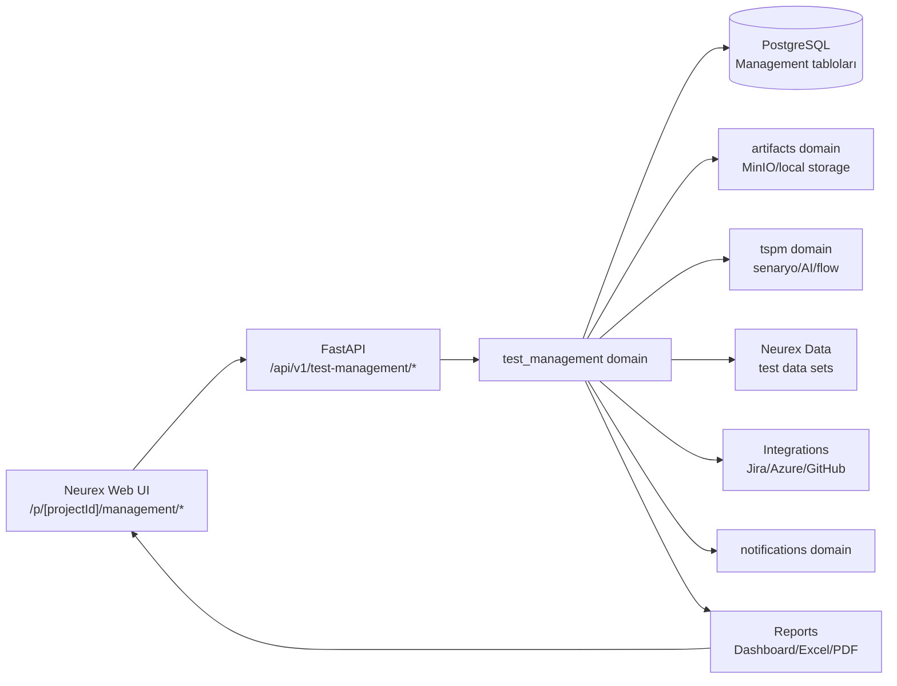

## Veri Sahipliği

| Veri | Ana sahibi | Saklama yeri | Kaynak |
|------|------------|--------------|--------|
| Management project | `test_management` | `test_management_projects` | UI, mevcut project bağlamı |
| Test suite/folder | `test_management` | `test_suites`, `test_folders` | UI, Excel import |
| Manual test case | `test_management` | `test_cases` | UI, Excel import, AI önerisi onayı |
| Test case step | `test_management` | `test_case_steps` | UI, Excel import, AI önerisi onayı |
| Test case version | `test_management` | `test_case_versions` | Case create/update/import |
| Test plan/cycle/run | `test_management` | `test_plans`, `test_cycles`, `test_runs` | QA Lead UI |
| Run case result | `test_management` | `test_run_cases` | Tester execute ekranı |
| Step result | `test_management` | `test_run_step_results` | Tester execute ekranı |
| Evidence metadata | `test_management` | `execution_evidence` | Tester upload |
| Evidence file | `artifacts` | object storage + artifact table | Upload service |
| Requirement link | `test_management` | `requirement_links` | UI, Jira/Azure sync, TSPM |
| Defect link | `test_management` | `defect_links` | UI, Jira/Azure/GitHub |
| Import job | `test_management` | `test_import_jobs`, `test_import_job_rows` | Excel/CSV import |
| Audit event | `test_management` | `test_management_audit_events` | Tüm write işlemleri |
| Notification | `notifications` | notification tables | Assignment, blocked, failed |
| AI önerisi | `tspm` veya `ai` | draft/suggestion tables | AI generation |
| Automation result | `automation/tspm` + mapping | automation result tables + mapping | CI/runner result |

## Ana Veri Akışları

### 1. Manuel Test Case Oluşturma

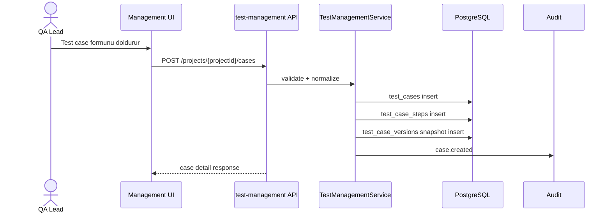

Saklanan tablolar:

| Tablo | Ne saklanır? |
|-------|--------------|
| `test_cases` | Başlık, priority, type, status, owner, tags, custom fields |
| `test_case_steps` | Action, expected result, step order, test data |
| `test_case_versions` | Case + steps JSON snapshot |
| `test_management_audit_events` | Kim oluşturdu, ne zaman oluşturdu |

### 2. Excel/CSV Import

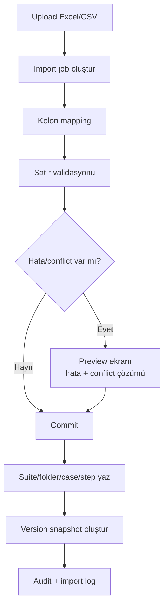

Saklanan tablolar:

| Tablo | Ne saklanır? |
|-------|--------------|
| `test_import_jobs` | Dosya adı, durum, mapping, toplam/geçerli/hatalı satır |
| `test_import_job_rows` | Satır bazlı parsed data, validation errors, conflict status |
| `test_suites` | Import ile gelen suite yoksa oluşturulur |
| `test_folders` | Folder path'e göre oluşturulur |
| `test_cases` | Yeni veya conflict çözülmüş case |
| `test_case_steps` | Step satırları |
| `test_case_versions` | Import sonrası initial snapshot |

Import commit edilmeden `test_cases` tablosuna yazılmaz.

### 3. Test Plan ve Run Oluşturma

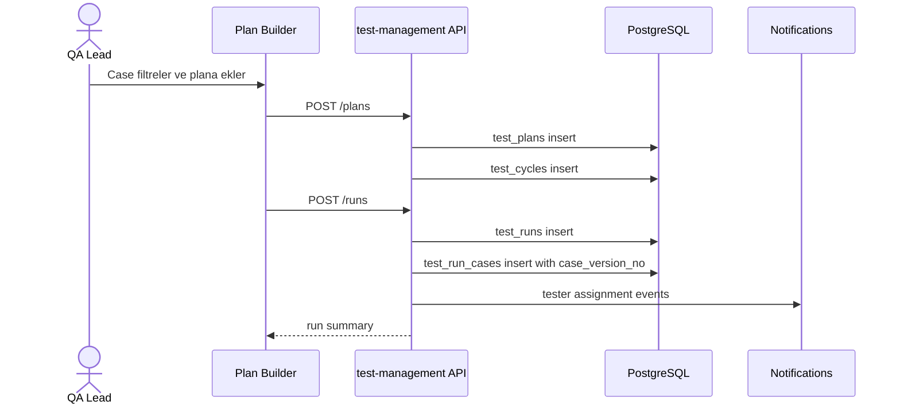

Saklama kuralı:

- Run oluşturulurken her test case'in o andaki `current_version` değeri `test_run_cases.case_version_no` alanına yazılır.
- Sonradan test case değişse bile aktif run eski snapshot'a göre yürür.

Saklanan tablolar:

| Tablo | Ne saklanır? |
|-------|--------------|
| `test_plans` | Release/sprint/regression kapsamı |
| `test_cycles` | Ortam, build, cycle bilgisi |
| `test_runs` | Run adı, durum, zaman |
| `test_run_cases` | Run'a seçilen case, assigned tester, case version |

### 4. Tester Test Yürütme

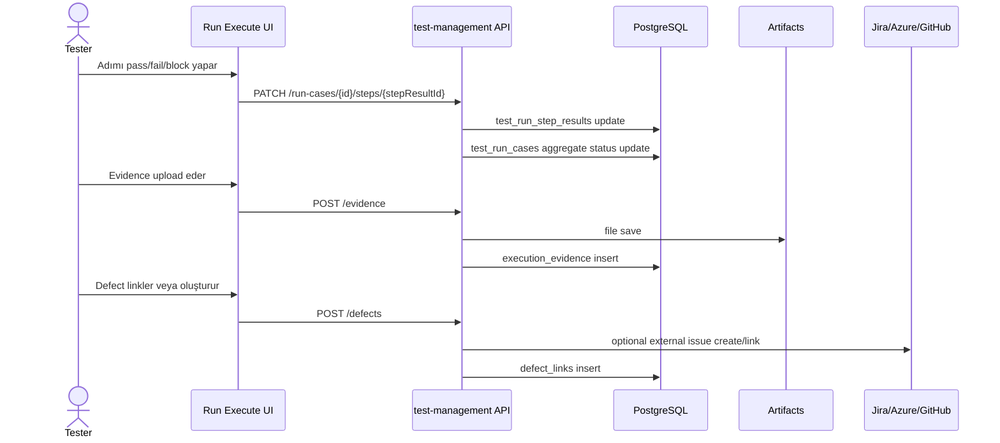

Saklanan tablolar:

| Tablo | Ne saklanır? |
|-------|--------------|
| `test_run_step_results` | Step bazlı status, actual result, comment |
| `test_run_cases` | Case bazlı final status, actual result, duration |
| `execution_evidence` | Evidence metadata ve artifact id |
| `defect_links` | External defect key, url, status |

### 5. Requirement Coverage

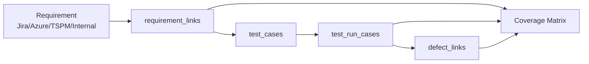

Coverage hesapları:

| Coverage sorusu | Kaynak |
|-----------------|--------|
| Requirement test ile kapsanmış mı? | `requirement_links.case_id` |
| Kapsayan testler ready mi? | `test_cases.status` |
| Son run sonucu ne? | `test_run_cases` latest by case |
| Requirement failed defect'e bağlı mı? | `defect_links` |
| Requirement stale mi? | Requirement updated_at > linked case updated_at |

### 6. Evidence Saklama

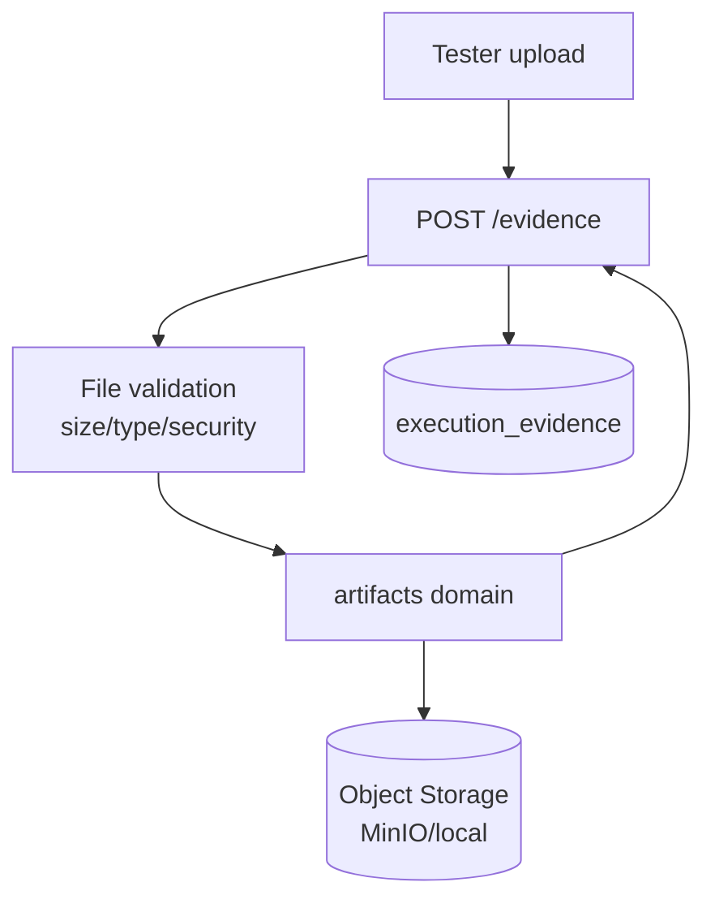

Evidence veri ayrımı:

| Parça | Nerede? |
|-------|---------|
| Dosyanın kendisi | Object storage |
| Dosya lifecycle/storage path | `artifacts` domain |
| Test sonucu ile ilişkisi | `execution_evidence` |
| Step/case bağlamı | `run_case_id`, `step_result_id` |

### 7. Notification Akışı

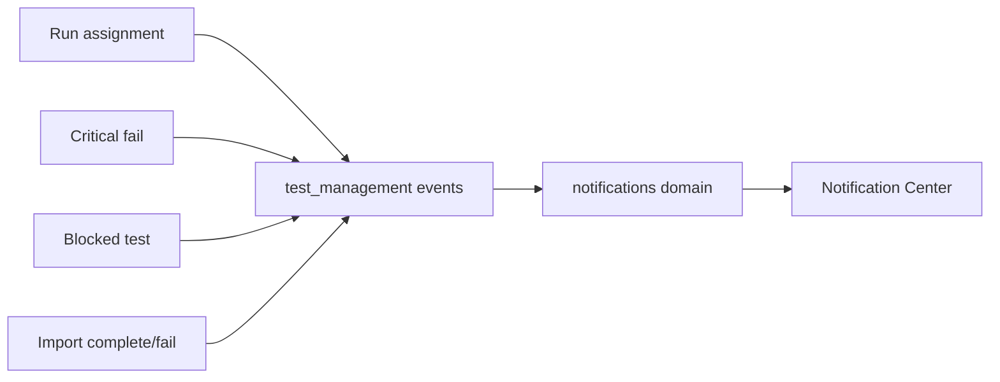

İlk notification eventleri:

| Event | Tetikleyici |
|-------|-------------|
| `test_management.run.assigned` | Tester'a run case atanır |
| `test_management.run_case.failed_critical` | Critical case failed olur |
| `test_management.run_case.blocked` | Case blocked olur |
| `test_management.import.completed` | Import commit tamamlanır |
| `test_management.import.failed` | Import validation/commit fail olur |

## Tablo Şeması Özeti

### Repository Tabloları

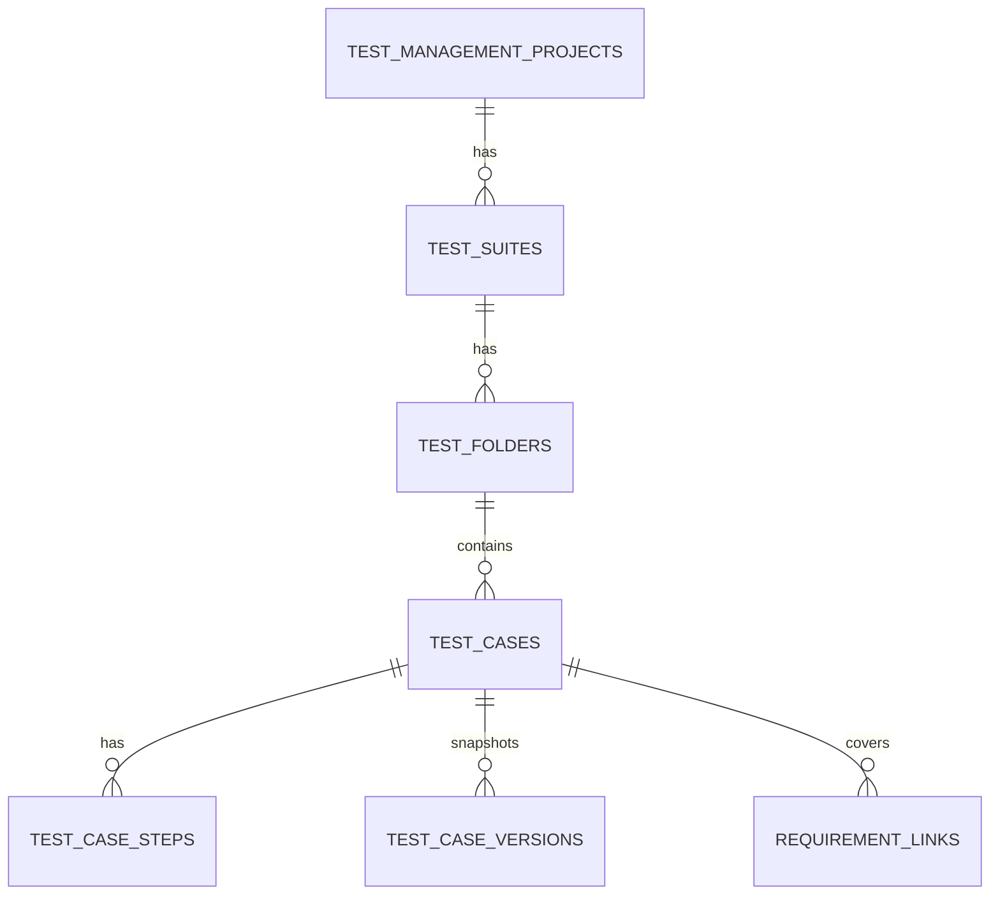

| Tablo | Primary kullanım |
|-------|------------------|
| `test_management_projects` | Management scope |
| `test_suites` | Modül/suite gruplama |
| `test_folders` | Ağaç yapı |
| `test_cases` | Ana manuel test kaydı |
| `test_case_steps` | Test adımları |
| `test_case_versions` | Değişiklik snapshot geçmişi |
| `requirement_links` | Coverage |

### Execution Tabloları

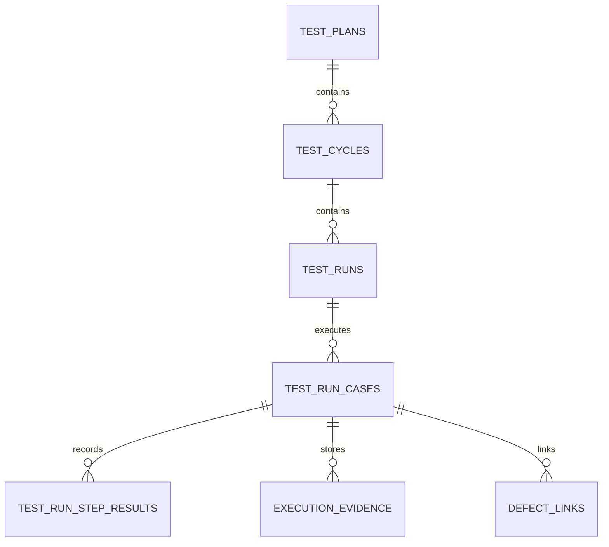

| Tablo | Primary kullanım |
|-------|------------------|
| `test_plans` | Release/sprint/regression planı |
| `test_cycles` | Ortam/build/cycle |
| `test_runs` | Aktif koşum |
| `test_run_cases` | Case assignment ve final result |
| `test_run_step_results` | Step bazlı actual result |
| `execution_evidence` | Evidence linkleri |
| `defect_links` | Bug/defect bağlantısı |

### Import ve Audit Tabloları

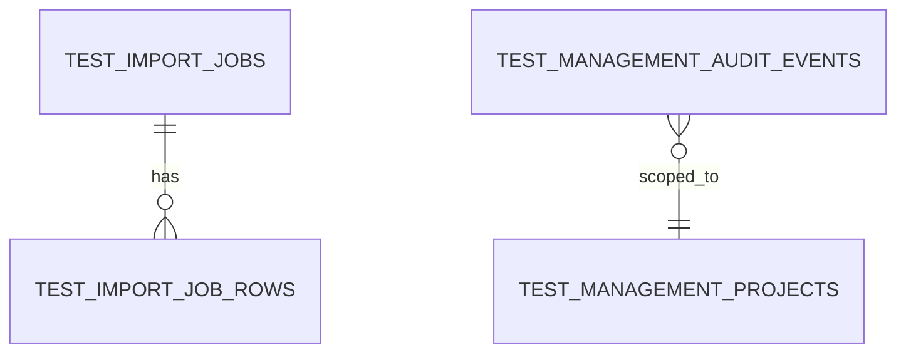

| Tablo | Primary kullanım |
|-------|------------------|
| `test_import_jobs` | Import oturumu |
| `test_import_job_rows` | Satır bazlı validation/conflict |
| `test_management_audit_events` | Kim neyi değiştirdi |

## Ekran Bazlı Veri Kaynakları

| Ekran | Nereden alır? | Nereye yazar? |
|-------|---------------|---------------|
| Dashboard | reports endpoints, latest runs, workload | Yazmaz |
| Repository | `test_cases`, `test_suites`, `test_folders`, latest run summary | case/folder/suite CRUD |
| Test Case Detail | `test_cases`, `test_case_steps`, `versions`, `requirements`, `runs` | case update, archive, clone |
| Test Plan Builder | repository filters, requirements, users | `test_plans`, `test_cycles`, `test_runs`, `test_run_cases` |
| Run Execute | `test_run_cases`, case version snapshot, step results | step result, case result, evidence, defect |
| Requirements | `requirement_links`, external requirements, latest run results | requirement link/unlink |
| Defects | `defect_links`, latest external status | defect link/create/update |
| Reports | calculated queries | export job |
| Import/Export | import jobs, row previews | import job, commit, export |
| Settings | statuses, custom fields, retention policy | settings tables veya config JSON |

## API - Tablo Eşlemesi

| API | Okur | Yazar |
|-----|------|-------|
| `GET /repository` | suites, folders, cases, latest run summary | - |
| `POST /suites` | project | test_suites, audit |
| `POST /folders` | suite/folder | test_folders, audit |
| `GET /cases` | test_cases, steps summary, filters | - |
| `POST /cases` | suite/folder/requirements | test_cases, steps, versions, audit |
| `PATCH /cases/{case_id}` | case current version | test_cases, steps, versions, audit |
| `POST /cases/{case_id}/clone` | case + steps | test_cases, steps, versions, audit |
| `POST /plans` | cases, requirements | test_plans, audit |
| `POST /runs` | plan/cycle/cases/users | test_runs, test_run_cases, notifications |
| `PATCH /run-cases/{id}` | run_case | test_run_cases, audit |
| `PATCH /run-cases/{id}/steps/{step_id}` | step_result | test_run_step_results, aggregate run_case |
| `POST /evidence` | artifact response | artifacts, execution_evidence |
| `POST /defects` | external issue optional | defect_links |
| `GET /reports/execution-summary` | runs, run_cases | - |
| `GET /reports/coverage-matrix` | requirement_links, cases, run_cases, defects | - |
| `POST /imports` | uploaded file | import_jobs, import_job_rows |
| `POST /imports/{id}/commit` | import_job_rows | suites, folders, cases, steps, versions |
| `POST /exports` | selected report/repository | export artifact |

## Durum Güncelleme Kuralları

### Step Result -> Run Case Aggregate

```text
if any step failed      => run_case.status = failed
else if any step blocked => run_case.status = blocked
else if all required steps passed => run_case.status = passed
else if all skipped      => run_case.status = skipped
else                     => run_case.status = in_progress
```

### Run Case -> Run Aggregate

```text
if all run_cases terminal => run.status = completed
else if any run_case in_progress => run.status = in_progress
else run.status = not_started
```

Terminal statuses:

```text
passed, failed, blocked, skipped, retest
```

## Dış Sistemlerden Veri Alma

| Dış kaynak | Ne alınır? | Ne zaman alınır? | Nerede saklanır? |
|------------|------------|------------------|------------------|
| Jira | Story/bug key, title, status, URL | link/create/sync | `requirement_links`, `defect_links` |
| Azure DevOps | Work item id, title, state, URL | link/create/sync | `requirement_links`, `defect_links` |
| GitHub Issues | Issue number, title, state, URL | defect link/create | `defect_links` |
| TSPM | Scenario/requirement references | case link veya import | `requirement_links`, optional `source_ref` |
| Neurex Data | Dataset id, masked data refs | case test data binding | `test_cases.test_data` veya Faz 2 binding table |
| Artifacts | file id/path/hash | evidence upload | `execution_evidence.artifact_id` |

## Geliştirme İçin İlk Saklama Sırası

Backend migration ve servisler şu sırayla açılmalı:

1. Repository: project, suite, folder, case, step, version
2. Planning: plan, cycle, run, run_case
3. Execution: step_result, evidence, defect_link
4. Traceability: requirement_link, coverage queries
5. Import: import_job, import_job_row, commit
6. Audit: write event recording
7. Reports: execution summary, coverage matrix, workload

## Kısa Sonuç

`Neurex Management` veriyi şu mantıkla saklayacak:

- Kalıcı test hafızası: `test_cases` + `test_case_steps` + `test_case_versions`
- Koşum hafızası: `test_runs` + `test_run_cases` + `test_run_step_results`
- Kanıt hafızası: `execution_evidence` + `artifacts`
- Kalite ilişkileri: `requirement_links` + `defect_links`
- Operasyon geçmişi: `test_import_jobs` + `test_management_audit_events`

Veri ana kaynağı Management domain olacak; TSPM, AI, Data, Artifacts ve Integrations bu domaini besleyen veya zenginleştiren yardımcı sistemler olarak kalacak.
