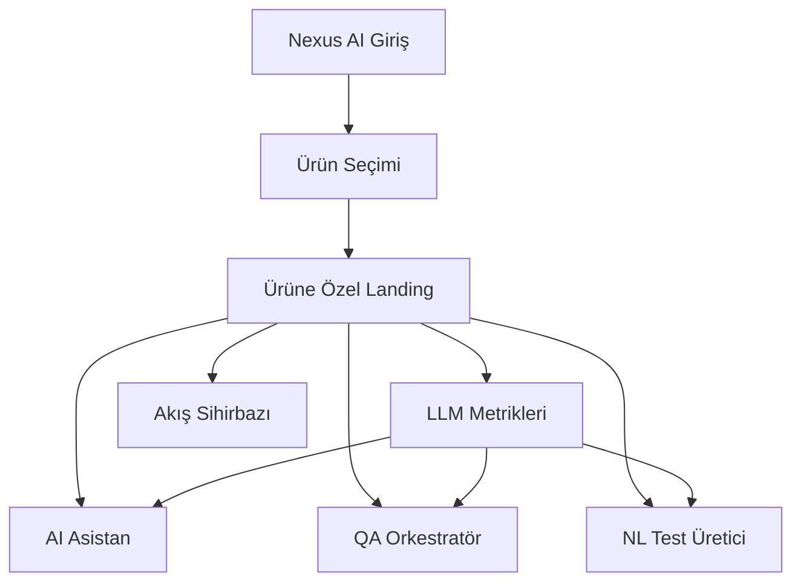

# Nexus AI — Ekran Akışları ve Kullanıcı Yolculuğu

## 1. Bilgi Mimarisi

## 2. Ana Yolculuk

### Yolculuk A — QA Lead İlk Giriş

1. Kullanıcı `Nexus AI` içine girer.
2. Ürün seçim ekranında ürünlerden birini seçer.
3. Sistem, seçilen ürün için ayrı landing sayfasına yönlendirir.
4. Landing sayfasında:
   - modül kartlarını görür
   - ürün bağlamlı önerilen projeleri görür
   - sağ panelde başlangıç yolunu görür
5. Birincil CTA ile `LLM Metrikleri` ekranına gider.
6. Sorunlu veya yavaş alanı tespit eder.
7. Aynı bağlamla `AI Asistan` veya `QA Orkestratör`e geçer.

### Yolculuk B — Metrikten Aksiyona

1. Kullanıcı `LLM Metrikleri` ekranında düşük kalite veya düşük hız sinyali görür.
2. İlgili metrik kartından "nedenini incele" veya "aksiyon başlat" eylemini seçer.
3. Sistem bağlamı kaybetmeden ilgili modüle geçirir.
4. Kullanıcı:
   - asistanla debug başlatır, veya
   - orkestratörde pipeline tetikler, veya
   - NL Test Üretici ile yeni artefakt üretir.

### Yolculuk C — Onboarding

1. Ürün landing ekranının sağ panelinde sistem bir başlangıç rotası gösterir.
2. Kullanıcı ilk adımı tamamladıkça rota güncellenir.
3. Bu rota gerçek yönlendirme akışıdır; yalnızca statik bilgi paneli değildir.

## 3. Sayfa Bazlı İçerik

### 3.1 Ürün Seçimi

Amaç:
- kullanıcının bağlamı hızlı seçmesi

Bileşenler:
- ürün segment kartları
- ürün kısa açıklaması
- ürünün hangi modülleri öne çıkardığı
- hızlı durum bilgisi

Karar:
- kart tıklanınca aynı shell'de sekme değişimi değil, ayrı ürün sayfasına geçilir

### 3.2 Ürüne Özel Landing

Amaç:
- ürün bağlamını netleştirmek
- modülleri anlamlı sırayla sunmak

Yerleşim:
- sol ve orta alan: ürün açıklaması + modül kartları
- sağ alan: başlangıç yolu
- alt veya orta blok: önerilen projeler

Önerilen modül sırası:
1. `LLM Metrikleri`
2. `AI Asistan`
3. `QA Orkestratör`
4. `NL Test Üretici`
5. `Akış Sihirbazı`

### 3.3 LLM Metrikleri

Amaç:
- ilk değer ekranı olmak

Zorunlu bloklar:
- toplam kullanım
- görev bazlı başarı
- test üretim hızı
- problemli akışlar
- önerilen aksiyonlar

Eylemler:
- `AI Asistan ile incele`
- `Pipeline başlat`
- `Test üret`
- `İlgili projeyi aç`

### 3.4 AI Asistan

Amaç:
- metrik ve bağlam sinyalini doğal dilden aksiyona çevirmek

Zorunlu bileşenler:
- bağlam rozeti: ürün + proje
- konuşma alanı
- önerilen kısa aksiyon çipleri
- sonuç artefaktı oluşturma alanı

### 3.5 QA Orkestratör

Amaç:
- çok adımlı AI görevlerini görünür ve güvenli şekilde yönetmek

Zorunlu bileşenler:
- akış başlatma
- step listesi
- canlı durum
- retry ve fallback durumu
- otomatik uygulama açıldı veya kapalı bilgisi

### 3.6 NL Test Üretici

Amaç:
- doğal girdiden hızlı artefakt üretimi

Zorunlu bileşenler:
- girdi metni
- çıktı türü seçimi
- sonuç paneli
- düzelt ve yeniden üret akışı
- kaydet veya aktar aksiyonu

## 4. Başlangıç Yolu Mantığı

Sağ paneldeki başlangıç yolu aşağıdaki mantıkla çalışmalıdır:

1. Ürün seçildi mi?
2. Önerilen proje seçildi mi?
3. Kullanıcının ilk durağı ne?

QA Lead için varsayılan ilk durak:
- `LLM Metrikleri`

Ardından ürün bağlamına göre ikinci durak:
- `AI Asistan` veya `QA Orkestratör`

## 5. Navigasyon Kararları

- Ürünler arasında bağlam geçişi shell tab olarak değil, rota bazlı sayfa geçişiyle yapılır.
- Ürün sayfaları aynı tasarım dilini korur ama içerik, önerilen proje listesi ve
  başlangıç yolu farklılaşır.
- Landing sayfası modül vitrini değil, karar ve yönlendirme yüzeyi olmalıdır.

## 6. Kritik UX İlkeleri

1. Açılışta kullanıcıya sohbet kutusu değil, durum görünürlüğü verilir.
2. Her ekranda ürün ve proje bağlamı görünür kalır.
3. Her ana metrik veya sonuç ekranı en az bir aksiyona bağlanır.
4. Aynı bağlamı yeniden seçtiren gereksiz adımlardan kaçınılır.
5. Otomatik uygulama eylemleri görünmez şekilde değil, açık durum etiketi ile sunulur.
