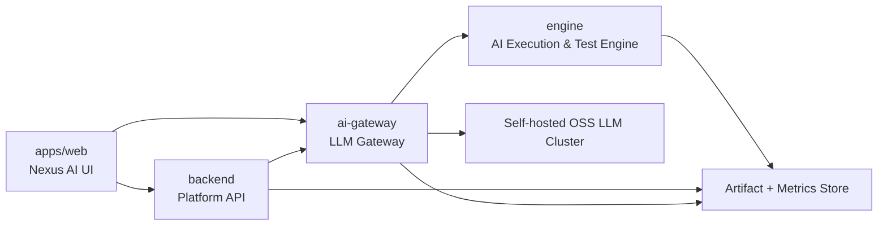

# Nexus AI — Visium Intelligence Teknik Mimari

## 1. Mimari Hedef

Bu mimarinin amacı, `Nexus AI` içindeki `Visium Intelligence` modülünü:
- kurum içi açık kaynak LLM altyapısıyla
- çok ürünlü bağlam desteğiyle
- güvenli ve denetlenebilir otomasyon mantığıyla
- ölçülebilir ve geliştirilebilir bir servis yapısıyla
çalıştırmaktır.

## 2. Üst Seviye Mimari

## 3. Katmanlar

### 3.1 UI Katmanı

Sorumluluklar:
- ürün seçimi
- ürün özel landing sayfaları
- LLM metrik dashboard'u
- AI asistan arayüzü
- orkestratör ve üretici ekranları

Ana kural:
- ürün seçimi sonrası bağlam route seviyesinde değişir

### 3.2 Platform API Katmanı

Sorumluluklar:
- kullanıcı ve yetki yönetimi
- proje ve ürün bağlamı sağlama
- önerilen proje listeleri
- artefakt kayıt uçları
- metrik sorgu uçları

### 3.3 LLM Gateway Katmanı

Sorumluluklar:
- merkezi prompt çözümleme
- model yönlendirme
- inference çağrıları
- telemetry
- policy enforcement
- prompt profilleri
- json, code, gherkin format koruma

Ana kural:
- tüm LLM çağrıları gateway üzerinden geçmelidir

### 3.4 Execution Engine Katmanı

Sorumluluklar:
- QA orkestrasyonu
- test artefaktı üretimi
- self-healing
- assertion önerileri
- güvenlik analizi
- pipeline yönetimi

### 3.5 Self-hosted LLM Katmanı

Sorumluluklar:
- kurum içi inference
- model versiyonları
- görev tipine göre uygun açık kaynak model kullanımı

Karar:
- dış provider zorunlu fallback kullanılmaz

## 4. Prompt ve Policy Yönetimi

Kanonik prompt kaynağı:
- [prompt_center/manifest.json](/Users/yasin_bulgan/Desktop/Cortex_Ai_Automation/prompt_center/manifest.json)

Yapı:
- ortak policy parçaları
- görev promptları
- engine promptları
- merkezi registry

Kural:
- prompt ve model ayarlarını yalnızca teknik ekip yönetebilir

## 5. Çok Ürünlü Bağlam

Sistem şu varlıkları ilk sınıf citizen olarak taşımalıdır:
- ürün ailesi
- ürün
- proje
- görev tipi
- artefakt
- metrik akışı

Bu nedenle veri modeli ve route yapısı ürün bağlamını taşıyacak şekilde
tasarlanmalıdır.

## 6. Veri Akışı

### Akış A — Metrik Dashboard

1. UI ürün ve proje bağlamıyla sorgu açar.
2. Backend metrik özetini döndürür.
3. Gateway kaynak model ve görev verilerini besler.
4. Sonuç dashboard kartlarında gösterilir.

### Akış B — Doğal Dilden Test Üretimi

1. Kullanıcı girdi verir.
2. UI bunu gateway veya engine hattına yollar.
3. Prompt center bağlamı çözer.
4. Self-hosted model çağrılır.
5. Sonuç doğrulanır.
6. Artefakt store'a yazılır.
7. Sonuç birden fazla hedefe kaydedilir.

### Akış C — QA Orkestrasyonu

1. Kullanıcı pipeline başlatır.
2. Engine step dizisini oluşturur.
3. Gateway her adım için uygun promptu yükler.
4. Sonuçlar step bazlı kaydedilir.
5. Gerekirse retry veya fallback uygulanır.
6. Otomatik uygulama whitelist içinde ise eylem tetiklenir.

## 7. Veri Saklama

Artefaktlar birden fazla yerde tutulacaktır:
- sohbet geçmişi kaydı
- proje altında kayıtlı içerik
- dosya veya git çıktısı

Bu yüzden aşağıdaki entity'ler önerilir:
- `Artifact`
- `ArtifactTarget`
- `PromptVersion`
- `ModelRun`
- `EvaluationScore`
- `AutomationAction`
- `AuditEvent`

## 8. Güvenlik Mimarisinin Zorunlu Kuralları

1. Müşteri verisi dış modele gitmez.
2. Girdi sınıflandırması ve maskeleme inference öncesi çalışır.
3. Hassas alanlar prompta ham halde yazılmaz.
4. Otomatik uygulama sadece izinli akışlarda çalışır.
5. Tüm önemli aksiyonlar audit log'a düşer.
6. Tenant ve proje izolasyonu zorunludur.

## 9. Otomasyon Sınırları

İzinli otomatik akış örnekleri:
- non-production test artefaktı oluşturma
- önerilen dosyaya kayıt
- otomatik pipeline devam ettirme

Kısıtlı akış örnekleri:
- prod benzeri ortama etkili işlemler
- müşteri verisiyle çalışan aksiyonlar
- geri dönüşü zor uygulamalar

## 10. Observability

Toplanacak sinyaller:
- görev tipi bazlı latency
- model bazlı çıktı kalitesi
- test üretim hızı
- retry oranı
- otomatik uygulama oranı
- başarısız pipeline oranı

## 11. Faz 1 İçin Teknik Çıktılar

- ürün bazlı route yapısı
- LLM dashboard veri katmanı
- merkezi prompt yönetimi
- self-hosted inference entegrasyonu
- artefakt çoklu hedef kaydı
- audit log tabanı
- ürün bağlamlı önerilen proje API'leri

## 12. Mimari Başarı Kriteri

Bu mimari başarılı kabul edilir, eğer:
- tüm LLM çağrıları merkezi yönetiliyorsa
- dış modele veri akışı yoksa
- ürün ve proje bağlamı her ana akışta korunuyorsa
- metrikten aksiyona geçiş aynı sistem içinde sağlanıyorsa
- otomatik uygulama teknik ekip sınırlarıyla kontrol altında tutuluyorsa
