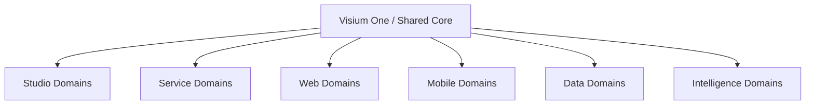

# Visium Domain Ayrıştırma Planı

## Amaç

Bu doküman, Visium ürün ailesinin teknik olarak nasıl sınırlandırılacağını açıklar.

Hedef:

- bugün monorepo kalmak
- ama yarının ürün ve servis sınırlarını bugünden netleştirmek

Bu bir mikroservis emri değildir.
Bu, önce **domain clarity**, sonra gerekirse **service separation** yaklaşımıdır.

---

## Tasarım İlkesi

Temel karar:

> Kod tabanı ürünlere göre değil, önce domain’lere göre netleşmeli; ürünler bu domain’lerin tutarlı birleşimlerinden oluşmalı.

Bu yüzden iki farklı harita gerekir:

1. ürün haritası
2. teknik domain haritası

Bu iki harita birebir aynı olmak zorunda değildir.

---

## Hedef Teknik Katmanlar



---

## 1. Shared Core

Bu alan tüm ürünlerin ortak çekirdeğidir.

### Sorumluluklar

- auth
- user / membership
- role / permission
- audit
- notifications
- integrations registry
- artifacts
- common workspace/project model
- billing ve plan hooks

### Repo eşleşmesi

- `backend/app/domains/auth`
- `backend/app/domains/audit`
- `backend/app/domains/notifications`
- `backend/app/domains/artifacts`
- `backend/app/domains/integrations` benzeri yüzeyler

### Kural

Shared core, ürün spesifik iş akışı barındırmamalı.

Yanlış örnek:

- API healing logic
- synthetic data generation flow
- mobile device scheduling

Doğru örnek:

- artifact saklama
- auth
- audit log

---

## 2. Studio Domain Boundary

### Sorumluluklar

- import pipeline
- requirement extraction
- coverage graph
- scenario lifecycle
- approvals
- regression set planning
- workflow definition

### Repo eşleşmesi

- `backend/app/domains/tspm`

### Zamanla ayrıştırılmalı alt parçalar

- `studio_import`
- `studio_requirements`
- `studio_scenarios`
- `studio_approvals`
- `studio_regression`

### Kritik not

Bugün `tspm` çok geniş. İlk doğru adım servis ayırmak değil, `tspm` içini alt domain modüllerine ayırmaktır.

---

## 3. Service Domain Boundary

### Sorumluluklar

- spec parser
- endpoint graph
- collection model
- request execution
- assertion engine
- coverage analyzer
- flaky detector
- prioritizer
- security scanning
- self-healing retry

### Repo eşleşmesi

- `backend/app/domains/api_testing`

### Durum

Bu alan zaten ürünleşmeye en hazır domain.

### Ayrı contract gerektiren parçalar

- spec ingestion
- execution engine
- analytics
- healing

### Kural

Service domain, Studio domain’den veri alabilir ama ona gömülmemeli.

Örnek:

- requirement’tan API test çıkarabilir
- ama senaryo CRUD’nun içinde yaşamamalı

---

## 4. Web Automation Domain Boundary

### Sorumluluklar

- feature generation
- locator repository
- page object management
- recorder
- execution orchestration
- visual regression
- accessibility
- monkey testing

### Repo eşleşmesi

- `engine/`
- `backend/app/domains/automation`
- `backend/app/domains/tspm` içindeki automation parçaları

### Sorun

Bugün web otomasyon mantığı hem `engine` hem `tspm` hem frontend sayfalarına dağılmış durumda.

### Hedef

Bu alan sonunda şu boundary ile netleşmeli:

- `web_automation_design`
- `web_automation_execution`
- `web_automation_observability`

---

## 5. Mobile Domain Boundary

### Sorumluluklar

- device profiles
- app upload registry
- device scheduling
- mobile run execution
- stream/events
- mobile artifacts
- future Appium / device cloud adapters

### Repo eşleşmesi

- `engine/routes/mobile_routes.py`
- `backend/app/domains/tspm` içindeki mobile run yüzeyi

### Durum

Bu alan henüz erken fazda ama ürün ailesi açısından ayrı kimlik taşımaya başlamış durumda.

### Kural

Mobile domain, Web domain’den ayrı yürümeli.

Sebep:

- cihaz matrisi
- artifact türleri
- koşu maliyeti
- environment modeli

farklıdır.

---

## 6. Data Domain Boundary

### Sorumluluklar

- synthetic data generation
- privacy audit
- masking
- noise/anonymization
- test data catalog
- scenario data binding
- fidelity and quality evaluation
- domain packs

### Repo eşleşmesi

- `synthetic-data/platform-v4`
- `engine/ai_synthetic_data`
- `backend` içindeki synthetic data API’leri

### Kritik karar

Data domain, test yardımcı modülü gibi değil, ayrı değer üreten ürün çekirdeği olarak ele alınmalı.

### Kural

Data domain hem Studio’ya hem Service’e hem Web/Mobile’a veri verebilir ama onların içine gömülmemeli.

---

## 7. Intelligence Domain Boundary

### Sorumluluklar

- model routing
- prompt orchestration
- AI chat
- recommendation layer
- NL generation
- quality metrics
- agent orchestration
- cross-product memory/context

### Repo eşleşmesi

- `backend/app/domains/ai`
- `backend/app/domains/agents`

### Kritik karar

Intelligence domain bir “ekran koleksiyonu” değil, yatay servis katmanıdır.

### Kural

AI yeteneği ürünlere gömülebilir ama contract’ı yatay kalmalı.

Örnek:

- `Studio` için scenario suggestion
- `Service` için assertion suggestion
- `Web` için locator healing
- `Data` için privacy recommendation

aynı katmandan çıkmalı.

---

## Backend Ayrıştırma Hedefi

### Bugünkü yapı

- `tspm` çok geniş
- `api_testing` daha net
- `ai` ve `agents` yatay ama zaman zaman iş akışına karışıyor

### Hedef yapı

```text
backend/app/domains/
  core/
    auth/
    audit/
    artifacts/
    notifications/
    memberships/
  studio/
    imports/
    requirements/
    scenarios/
    approvals/
    regression/
  service/
    specs/
    collections/
    execution/
    healing/
    security/
    analytics/
  web_automation/
    design/
    locators/
    recorder/
    execution/
    observability/
  mobile/
    devices/
    uploads/
    execution/
    streaming/
  data/
    synthetic/
    privacy/
    quality/
    bindings/
  intelligence/
    chat/
    orchestration/
    metrics/
    generation/
```

Bu hedef dizin yapısı, bugünden birebir uygulanmak zorunda değil; ama refactor yönü bu olmalı.

---

## Frontend Ayrıştırma Hedefi

### Bugünkü sorun

Tek dashboard altında çok fazla route var.

### Hedef

UI şu mantıkla düşünülmeli:

- `app/(platform)` → One
- `app/(studio)` → Studio
- `app/(service)` → Service
- `app/(web-automation)` → Web
- `app/(mobile)` → Mobile
- `app/(data)` → Data
- `app/(intelligence)` → Intelligence

### İlk geçişte

Fiziksel route ayrımı şart değil.

Ama en azından şu merkezi map bulunmalı:

- route segment
- ait olduğu ürün
- ait olduğu domain
- ait olduğu persona

Bu map, shell ve analytics için çok değerli olur.

---

## Paylaşılan Sözleşmeler

Ürün ailesi sağlıklı büyüsün diye aşağıdaki contract’lar ortaklaşmalıdır:

### 1. Project Context Contract

- project_id
- workspace_id
- environment
- tags
- artifact references

### 2. Execution Contract

- run_id
- status
- started_at / finished_at
- summary
- artifact list
- stream endpoint

### 3. Recommendation Contract

- source product
- target product
- confidence
- evidence
- suggested action

### 4. Artifact Contract

- artifact_type
- product
- mime_type
- storage_path
- metadata

---

## 90 Günlük Teknik Plan

### İlk 30 gün

- ürün-domain map çıkar
- `tspm` alt alanlarını adlandır
- `product.ts` benzeri merkezi family config oluştur
- route → product eşleşmesini merkezi hale getir

### 30-60 gün

- shared core boundary netleştir
- studio/service/web/mobile/data/intelligence ownership matrisi çıkar
- frontend navigation’ı ürün bazlı hale getir

### 60-90 gün

- `tspm` içi ilk alt domain refactor
- execution contract ortaklaştırma
- AI orchestration contract’larını standardize et

---

## Önerilen Ownership Matrisi

### Studio Team

- requirements
- scenarios
- approvals
- workflows
- regression

### Service Team

- specs
- collections
- execution
- security
- healing

### Automation Team

- web automation
- locator strategy
- visual/a11y
- execution runtime

### Mobile Team

- devices
- mobile runs
- app artifacts

### Data Team

- synthetic data
- privacy
- quality
- bindings

### Intelligence Team

- shared AI layer
- recommendation logic
- metrics
- orchestrator

---

## Nihai Öneri

Bu repo için doğru sıra:

1. ürünleri adlandır
2. domain’leri netleştir
3. navigation’ı buna göre düzenle
4. sonra ancak gerekiyorsa servisleştir

Yani:

> İlk yatırım mikroservis değil, sınır netliği olmalı.
