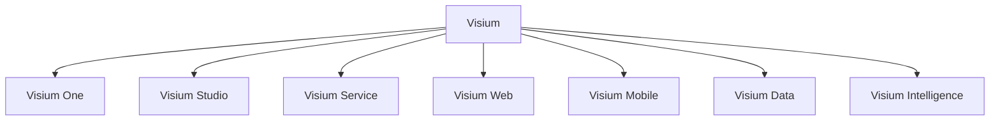

# Visium Ürün Ağacı ve Menü Mimarisi

## Amaç

Bu doküman, `Visium` ürün ailesinin kullanıcıya nasıl sunulacağını netleştirir:

- hangi ürünler var
- hangileri çekirdek, hangileri uzmanlaşmış ürün
- global menü nasıl görünmeli
- mevcut route’lar hangi ürün altında toplanmalı

Bu çalışma, [visium-urun-ailesi-arastirma.md](/Users/yasin_bulgan/Desktop/BGTS_Test_Donusum/docs/visium-urun-ailesi-arastirma.md) içindeki stratejik araştırmanın uygulama seviyesindeki devamıdır.

---

## Nihai Karar

Önerilen kurgu:

- ana marka: `Visium`
- platform çekirdeği: `Visium One`
- ürün ailesi:
  - `Visium Studio`
  - `Visium Service`
  - `Visium Web`
  - `Visium Mobile`
  - `Visium Data`
- yatay AI katmanı:
  - `Visium Intelligence`

Bu modelde kullanıcı tek bir çalışma alanına girer ama hangi problem alanında çalıştığını açık biçimde hisseder.

---

## Ürün Ağacı

### Visium One

Rolü:

- platform çekirdeği
- workspace, üyelik, audit, entegrasyon, ortak proje modeli

Kullanıcı tipi:

- admin
- lead
- platform owner

### Visium Studio

Rolü:

- test tasarımı
- onay ve yönetişim

Kullanıcı tipi:

- analist
- QA tasarımcı
- test lead

### Visium Service

Rolü:

- servis ve API testi
- coverage, assertion, chain, healing

Kullanıcı tipi:

- backend QA
- SDET
- API kalite mühendisi

### Visium Web

Rolü:

- web UI otomasyonu
- locator ve artifact üretimi

Kullanıcı tipi:

- UI automation engineer
- QA engineer

### Visium Mobile

Rolü:

- mobil cihaz matrisi
- paralel mobil koşu
- cihaz bazlı artifact toplama

Kullanıcı tipi:

- mobile QA
- release QA

### Visium Data

Rolü:

- sentetik veri
- test data
- privacy ve quality

Kullanıcı tipi:

- QA
- veri yönetişimi ekipleri
- compliance tarafı

### Visium Intelligence

Rolü:

- AI yardımcısı değil, tüm ürünlerin zeka katmanı

Kullanıcı tipi:

- tüm ürün kullanıcıları

---

## Menü Mimarisi

## Seviye 1: Global Ürün Navigasyonu

Üst veya sol ilk katman şu şekilde görünmeli:

1. `One`
2. `Studio`
3. `Service`
4. `Web`
5. `Mobile`
6. `Data`
7. `Intelligence`

Bu katmanın amacı kullanıcıya “hangi ürün alanındayım?” cevabını vermek.

## Seviye 2: Ürün İçi Navigasyon

Her ürünün kendi yerel menüsü olur.

### Visium One

- Workspace
- Projects
- Members
- Roles
- Integrations
- Settings
- Audit

### Visium Studio

- Import
- Requirements
- Coverage
- Analysis
- Scenarios
- Test Cases
- Approvals
- Workflows
- Regression

### Visium Service

- Spec Import
- Collections
- API Testing AI
- Chain Builder
- Environments
- Executions
- History
- Security
- Healing
- Prioritization

### Visium Web

- Manual to Automation
- Automation Gen
- Manual Tests
- Automation
- Page Objects
- Locators
- Recorder
- Executions
- Visual
- Accessibility
- Monkey
- Reports

### Visium Mobile

- Device Matrix
- App Uploads
- Mobile Runs
- Live Stream
- Artifacts
- Reports

### Visium Data

- Synthetic
- Test Data
- Bindings
- Privacy
- Quality
- Domain Packs

### Visium Intelligence

- AI Chat
- QA Orchestrator
- AI Metrics
- NL Test Generator
- Recommendations

---

## Global Dashboard Kurgusu

Bugünkü `Akış Merkezi` mantığı tamamen kaybolmamalı.

Yeni öneri:

- giriş sayfası `Visium Home`
- ürün kartları görünür
- her ürün kartında:
  - son aktivite
  - önerilen sonraki adım
  - kritik KPI
  - hızlı aksiyon

Örnek:

- `Visium Studio`
  - 14 onay bekleyen senaryo
  - 6 eksik coverage alanı
- `Visium Service`
  - 3 flaky API testi
  - 2 güvenlik uyarısı
- `Visium Data`
  - 1 privacy audit bekliyor
  - 4 aktif synthetic data seti

Bu sayede kullanıcı hem ürün ailesini görür hem de tek ekranda kaybolmaz.

---

## Mevcut Route → Hedef Ürün Eşleşmesi

### Studio

- `/import`
- `/requirements`
- `/coverage`
- `/analysis`
- `/scenarios`
- `/test-cases`
- `/approvals`
- `/workflows`
- `/regression`

### Service

- `/api-testing`
- `/api-tests`
- `/chain-builder`
- `/environments`
- `/test-history`
- `/security`
- `/healing`
- `/prioritize`

### Web

- `/manual-to-automation`
- `/automation-gen`
- `/manual`
- `/automation`
- `/page-objects`
- `/locators`
- `/recorder`
- `/executions`
- `/runs`
- `/visual`
- `/accessibility`
- `/monkey`
- `/reports`
- `/debug-report`
- `/flaky`

### Mobile

- `/mobile`

### Data

- `/synthetic`
- `/test-data`
- `/privacy`

### Intelligence

- `/ai-chat`
- `/ai-metrics`
- `/qa-orchestrator`
- `/nl-test-gen`
- `/wizard`

### One

- `/settings`
- `/integrations`
- ortak proje/workspace yüzeyleri

---

## Paketleme Önerisi

### Başlangıç Paketleri

1. `Visium Core`
   - One + Studio
2. `Visium Quality`
   - Studio + Service + Web
3. `Visium Data`
   - Data
4. `Visium Mobile`
   - Mobile
5. `Visium Intelligence`
   - add-on veya enterprise layer

### Demo Paketi

İlk güçlü demo şunları birlikte göstermeli:

1. `Visium Studio`
2. `Visium Data`
3. `Visium Service`
4. `Visium Web` veya `Visium Mobile`

Sebep:

- tasarım
- veri
- koşu
- gözlem

zinciri tek hikayede birleşir.

---

## Uygulama Sırası

### Faz 1

- ürün ailesi bilgi mimarisi netleştir
- ortak marka sabitlerini çıkar
- route → ürün eşleşmesini merkezi hale getir
- shell içinde ürün bazlı menüye geçiş hazırlığı yap

### Faz 2

- global product switcher
- ürün bazlı landing page’ler
- ürün bazlı KPI kartları
- ürün bazlı yetki ve görünürlük

### Faz 3

- ayrı satış paketleri
- ürün bazlı onboarding
- ürün bazlı docs / help center

---

## Nihai Öneri

Bu repo için en doğru kurgu:

- içeride ortak platform
- dışarıda net ürün aileleri
- geçişte tek birden bire rebrand değil
- önce bilgi mimarisi
- sonra navigation
- sonra paketleme

Yani ilk hedef şu olmalı:

> “Tek büyük menü” hissinden çıkıp, “aynı çekirdek üstünde çalışan Visium ürünleri” hissine geçmek.
