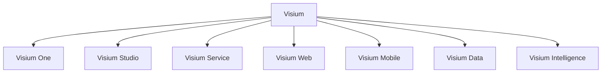

# Visium Ürün Ailesi Araştırması

## Amaç

Bu çalışma, mevcut BGTS kod tabanının tekil bir ürün gibi değil, **aynı platform çekirdeğini paylaşan bir ürün ailesi** gibi konumlandırılıp konumlandırılamayacağını araştırır.

Temel soru:

> Bu repo, tek bir “test platformu” olarak mı büyümeli, yoksa ortak çekirdek üstünde bir **Visium product family** mi olmalı?

Kısa cevap:

**Evet, bu repo tek ürün değil; zaten 5-6 ayrı ürün tohumu taşıyor.**
En doğru kurgu, bunları kopuk araçlar olarak değil, **tek platform çekirdeği + modüler Visium ürün ailesi** olarak paketlemek.

---

## Yönetici Özeti

Repo derinlemesine incelendiğinde aşağıdaki sonuç çıkıyor:

1. Mevcut yapı tek bir ürün sınırını çoktan aşmış durumda.
2. Frontend bilgi mimarisi bile ayrı ürün adaylarını gösteriyor.
3. Backend domain yapısı ayrı çözüm alanlarına bölünmeye hazır.
4. Pazarın başarılı örnekleri de “tek araç” değil, “platform + uzmanlaşmış ürünler” modeliyle ilerliyor.

Bu nedenle önerilen yapı:

- **Ana marka:** `Visium`
- **Platform çekirdeği:** `Visium One`
- **Ürün ailesi:** `Visium Studio`, `Visium Service`, `Visium Web`, `Visium Mobile`, `Visium Data`
- **Yatay zeka katmanı:** `Visium Intelligence`

Bu model, hem demoda daha net anlatılır hem de ürünleşme, lisanslama, ekip yapısı ve mimari sınırları çok daha sağlıklı hale getirir.

---

## Repo Bulguları

### 1. Arayüz zaten çok ürünlü bir yüzey sunuyor

Proje altındaki dashboard route’ları tek bir çözümden fazlasını gösteriyor:

- Test tasarımı ve yönetişim:
  - `requirements`
  - `coverage`
  - `scenarios`
  - `approvals`
  - `workflows`
- Servis/API testi:
  - `api-testing`
  - `api-tests`
  - `chain-builder`
  - `environments`
  - `test-history`
  - `security`
  - `healing`
- Web/UI otomasyonu:
  - `automation`
  - `automation-gen`
  - `manual-to-automation`
  - `locators`
  - `page-objects`
  - `recorder`
  - `visual`
  - `accessibility`
  - `monkey`
- Mobil:
  - `mobile`
- Veri:
  - `synthetic`
  - `test-data`
  - `privacy`
- AI/orchestrator:
  - `ai-chat`
  - `ai-metrics`
  - `qa-orchestrator`
  - `nl-test-gen`

Bu yüzey tek “dashboard app” değil; aslında bir ürün portföyü hissi veriyor.

### 2. Sidebar yapısı ürün adaylarını açıkça belli ediyor

`apps/web/components/AppShell.tsx` içinde şu kümeler zaten görünür:

- `Sentetik Veri`
- `API Testing AI`
- `Self-Healing`
- `QA Orkestrator`
- `Visium Farm`

Bu, ürün ailesine geçiş için önemli çünkü isimlendirme tohumu arayüzde çoktan başlamış.

### 3. Backend domain yapısı modülerleşmeye hazır

`backend/app/domains/` altında ayrı çözüm alanları zaten var:

- `tspm`
- `api_testing`
- `automation`
- `ai`
- `agents`
- `artifacts`
- `cicd`
- `notifications`

Bu modüller tek monolit içinde yaşasa da ürün sınırlarını teknik olarak çizmeye çok uygun.

### 4. Mobile tarafında “Visium” markası doğmuş

Repo içinde mobil yüzey doğrudan `Visium Farm` olarak adlandırılıyor:

- `apps/web/app/(dashboard)/p/[projectId]/mobile/page.tsx`
- `backend/app/domains/tspm/router.py` içindeki mobil koşum endpoint’leri
- `engine/routes/mobile_routes.py`

Bu çok önemli bir sinyal: marka ailesi fikri soyut değil, repo içinde zaten başlamış.

### 5. Sentetik veri tek özellik değil, ayrı ürün çekirdeği

Sentetik veri tarafı sadece küçük bir yardımcı özellik değil:

- ayrı research dokümanı var
- ileri privacy ve quality hook’ları var
- bağımsız üretim akışları var
- API ve UI yüzeyi var

Bu nedenle `test data` ile aynı görünse de ürünleşme açısından ayrı değer önerisi taşıyor.

### 6. API testing tarafı bağımsız ürün olabilecek kadar derin

`backend/app/domains/api_testing/` altında şu yetenekler mevcut:

- spec parser
- request executor
- assertion engine
- flaky detector
- test prioritizer
- self healer
- security scanner
- feedback loop

Bu derinlik, “API test ekranı” değil, doğrudan ayrı bir çözüm alanı demek.

---

## Pazar Araştırması

Bu karar yalnızca repo yapısına bakılarak verilmemeli. Güncel pazar deseninde başarılı kalite mühendisliği oyuncuları şu ortak modeli izliyor:

- ortak platform
- uzmanlaşmış ürünler
- yatay AI/insight katmanı

### 1. BrowserStack deseni: altyapı + uzmanlaşmış test ürünleri

BrowserStack tek ürün olarak değil, bir test ailesi gibi çalışıyor:

- web automation
- mobile automation
- visual testing
- real device cloud

Özellikle `App Automate` ve `Percy` birlikte kullanıldığında ürün ailesi yaklaşımı çok netleşiyor: mobil otomasyon ayrı, görsel doğrulama ayrı, ama platform aynı.

Araştırma notu:
- Mobil ürünlerini gerçek cihaz altyapısı üstünde ayrı konumluyor.
- Görsel test ürününü ayrı değer önerisiyle sunuyor.
- Ortak entegrasyon ve dashboard katmanı sağlıyor.

Kaynaklar:
- [BrowserStack App Automate](https://www.browserstack.com/app-automate/appium)
- [Percy by BrowserStack](https://www.browserstack.com/percy)
- [App Percy launch](https://www.browserstack.com/blog/product-launch-app-percy/)

### 2. Postman deseni: API yaşam döngüsü platformu + modüler çalışma yüzeyleri

Postman artık sadece request gönderme aracı olarak değil, API platformu olarak konumlanıyor:

- workspaces
- collections
- environments
- flows
- governance
- agent mode

Buradaki önemli desen şu:

- tek ürün gibi görünür
- ama içinde farklı personaya ve akışa hizmet eden modüler alt yüzeyler vardır

Bu, Visium için özellikle `Studio + Service + Intelligence` kurgusunda çok öğretici.

Kaynaklar:
- [Postman Workspaces](https://www.postman.com/product/workspaces/)
- [Postman Flows](https://www.postman.com/product/flows/)

### 3. Applitools deseni: AI katmanı olan test platformu

Applitools son dönemde ürün ailesini şu şekilde ayırıyor:

- `Autonomous`
- `Eyes`
- platform seviyesi intelligent testing katmanı

Bu desen bize şunu gösteriyor:

- functional test ayrı kalabilir
- visual doğrulama ayrı ürünleşebilir
- AI maintenance ve generation katmanı yatay servis olarak sunulabilir

Kaynaklar:
- [Applitools Platform Overview](https://applitools.com/platform-overview/)
- [Applitools Eyes](https://applitools.com/platform/eyes/)
- [Applitools Autonomous](https://applitools.com/platform/autonomous/)

### 4. Tonic.ai deseni: sentetik veri ayrı bir ürün kategorisidir

Tonic.ai resmi olarak sentetik veriyi “ek özellik” gibi değil, ürün ailesinin merkezinde konumluyor:

- test için güvenli veri
- referentially intact data
- privacy-first yaklaşım

Bu, repo içindeki sentetik veri modülünün neden ayrı ürünleşebileceğini destekliyor.

Kaynaklar:
- [Tonic.ai](https://www.tonic.ai/)
- [Tonic Structural](https://www.tonic.ai/products/tonic-structural)

---

## Sonuç: Visium İçin En Doğru Marka Mimarisi

### Önerilen model: Branded House + Shared Platform Core

Yani:

- tek ana marka: `Visium`
- alt ürünler tek çatı altında isimlendirilir
- ortak kimlik, yetki, veri modeli ve AI katmanı paylaşılır

Bu model neden doğru:

1. Repo zaten ortak çekirdek + ayrı çözüm alanları yapısına yakın.
2. Demo anlatımı güçlenir.
3. Fiyatlandırma ve paketleme kolaylaşır.
4. Ekip sınırları netleşir.
5. Gelecekte servis ayrıştırma yapılırsa marka tarafı kırılmaz.

### Kaçınılması gereken model

Tamamen bağımsız, ilişkisi zayıf alt markalar:

- ayrı login
- ayrı veri modeli
- ayrı kullanıcı algısı
- ayrı dashboard mantığı

Bu repo için erken ve pahalı olur.

---

## Önerilen Visium Ürün Ailesi

### 1. Visium One

Bu bir son kullanıcı ürünü değil, platform çekirdeği.

Sorumluluklar:

- tenant/workspace
- auth ve RBAC
- audit log
- artifacts
- notifications
- billing/paketleme
- ortak AI context
- ortak project/workspace modeli

Repo eşleşmesi:

- `auth`
- `audit`
- `artifacts`
- `notifications`
- ortak `projects` yüzeyi

### 2. Visium Studio

Amaç:

Test analizi, tasarım, onay ve yönetişim.

Yetkinlikler:

- import
- requirements
- coverage
- scenarios
- approvals
- workflows
- regression planning

Bu ürün, kalite ekipleri için “test design system of record” olur.

Repo eşleşmesi:

- `tspm`
- `import`
- `requirements`
- `coverage`
- `scenarios`
- `approvals`
- `regression`

### 3. Visium Service

Amaç:

Servis ve API kalite mühendisliği.

Yetkinlikler:

- spec import
- collection/test case üretimi
- chain builder
- environment orchestration
- assertion engine
- coverage analysis
- flaky detection
- security scanning
- self-healing retry

Bu ürün, Postman + intelligent QA layer karışımı gibi konumlanabilir.

Repo eşleşmesi:

- `backend/app/domains/api_testing`
- `api-testing`
- `api-tests`
- `chain-builder`
- `security`
- `healing`
- `test-history`

### 4. Visium Web

Amaç:

Web UI otomasyonu ve kalite doğrulama.

Yetkinlikler:

- recorder
- locators
- page objects
- manual-to-automation
- automation generation
- execution
- visual regression
- accessibility
- monkey testing

Bu ürün, web otomasyonu için operasyonel çalışma alanı olur.

Repo eşleşmesi:

- `engine`
- `automation`
- `automation-gen`
- `manual-to-automation`
- `locators`
- `page-objects`
- `visual`
- `accessibility`

### 5. Visium Mobile

Amaç:

Mobil test otomasyonu ve cihaz orkestrasyonu.

Yetkinlikler:

- app upload
- device matrix
- parallel mobile run
- live stream / SSE
- device artifacts
- mobile visual ve future Appium/device cloud entegrasyonu

Bugünkü `Visium Farm`, yarının `Visium Mobile` çekirdeği olabilir.

Repo eşleşmesi:

- `mobile`
- `engine/routes/mobile_routes.py`
- mobil run endpoint’leri

### 6. Visium Data

Amaç:

Test verisi, sentetik veri ve privacy güvenliği.

Yetkinlikler:

- synthetic generation
- test data binding
- masking
- privacy audit
- fidelity / quality scoring
- domain packs (özellikle bankacılık)

Bu ürün, sadece QA değil veri güvenliği ve geliştirme hızına da oynar.

Repo eşleşmesi:

- `synthetic`
- `test-data`
- `privacy`
- `engine/ai_synthetic_data`
- `synthetic-data/platform-v4`

### 7. Visium Intelligence

Bu birincil satış ürünü olmak zorunda değil; yatay AI katmanı olabilir.

Amaç:

Tüm ürün ailesine zeka sağlamak.

Yetkinlikler:

- AI chat
- QA orchestrator
- model router
- NL test generation
- AI metrics
- recommendation engines

Doğru kullanım şekli:

- ayrı ürün gibi pazarlanabilir
- ama ilk fazda daha güçlü kullanım, tüm ürünlere gömülü yatay katman olmasıdır

Repo eşleşmesi:

- `ai-chat`
- `qa-orchestrator`
- `ai-metrics`
- `nl-test-gen`
- `backend/app/domains/ai`
- `backend/app/domains/agents`

---

## En Doğru Paketleme Stratejisi

### Faz 1 paketleme

- `Visium One`
  - zorunlu platform katmanı
- `Visium Studio`
  - çekirdek ürün
- `Visium Service`
  - ikinci net ürün
- `Visium Data`
  - üçüncü net ürün
- `Visium Mobile`
  - beta / preview
- `Visium Intelligence`
  - tüm ürünlere gömülü

### Faz 2 paketleme

- `Visium Quality Cloud`
  - Studio + Service + Web
- `Visium Data Cloud`
  - Data + Privacy
- `Visium Mobile Cloud`
  - Mobile + device orchestration
- `Visium Intelligence`
  - add-on / enterprise layer

---

## Teknik Mimari Önerisi

### Bugün için

Tek monorepo kalabilir, ancak ürün sınırları netleştirilmeli.

Öneri:

- tek login
- tek workspace
- ürün bazlı navigation
- ortak billing/permissions
- domain bazlı backend boundary

### 6-12 ay içinde

Aşağıdaki servis sınırları ayrıştırılabilir:

- `visium-core`
- `visium-studio`
- `visium-service`
- `visium-mobile`
- `visium-data`
- `visium-intelligence`

Ama hemen mikroservis yapmak doğru değil.

İlk doğru adım:

- ürün sınırlarını isimlendir
- UI ve domain boundary’lerini netleştir
- sonra servisleşme gerekirse uygula

---

## Ürün Navigasyonu Önerisi

Bugünkü akış bazlı IA, ürün ailesi seviyesinde şöyle evrilebilir:

- `Visium One`
  - Workspace
  - Projects
  - Members
  - Integrations
- `Visium Studio`
  - Import
  - Requirements
  - Coverage
  - Scenarios
  - Approvals
- `Visium Service`
  - Specs
  - Collections
  - Chains
  - Environments
  - Security
  - Flaky/Healing
- `Visium Web`
  - Recorder
  - Locators
  - Automation
  - Executions
  - Visual
  - Accessibility
- `Visium Mobile`
  - Devices
  - App Uploads
  - Runs
  - Reports
- `Visium Data`
  - Synthetic
  - Test Data
  - Privacy
  - Quality

Bu yapı modül aramayı değil, ürün farkını görünür hale getirir.

---

## Repo İçin Somut Öneri

### Hemen yapılmalı

1. Ürün mimarisi kararı alınmalı:
   - `Visium` ana marka mı?
   - `BGTS` teknik kod adı mı kalacak?
2. `BGTS Test Platform` kimliği yerine platform çekirdeği + ürün ailesi tanımı yazılmalı.
3. Dashboard IA, ürün bazlı üst navigasyona hazırlanmalı.
4. Domain ownership tablosu oluşturulmalı.
5. Demo anlatısı ürün ailesi diliyle güncellenmeli.

### Şimdilik yapılmamalı

1. Her ürün için ayrı repo
2. Her ürün için ayrı login
3. Erken mikroservis parçalanması
4. UI’da aynı anda büyük rebrand + büyük mimari kırılım

---

## 90 Günlük Araştırma ve Doğrulama Planı

### Faz 0 — Konumlandırma

- `Visium` ana marka kararı
- alt ürün adları
- hedef persona matrisi
- ürün bazlı değer önerisi

### Faz 1 — Bilgi Mimarisi

- ürün bazlı navigation
- ortak workspace modeli
- ürün giriş sayfaları
- cross-sell / cross-workflow kurgusu

### Faz 2 — Teknik Sınırlar

- backend domain ownership
- shared services listesi
- artifact ve audit ortaklaştırma
- AI katmanının ürünler arası contract’ı

### Faz 3 — Go-to-Market Demo

- `Visium Studio -> Visium Service -> Visium Data -> Visium Mobile`
  zinciriyle 10 dakikalık demo
- her ürün için 1 net “aha moment”

---

## Nihai Önerim

Ben olsam şu yapıyı seçerim:

- **Ana marka:** `Visium`
- **Platform çekirdeği:** `Visium One`
- **İlk üç ürün:**  
  - `Visium Studio`  
  - `Visium Service`  
  - `Visium Data`
- **Gelişen ürünler:**  
  - `Visium Web`  
  - `Visium Mobile`
- **Yatay AI katmanı:**  
  - `Visium Intelligence`

Kısa gerekçe:

- Repo buna teknik olarak hazır.
- Arayüz buna semantik olarak yakın.
- Pazar buna göre şekilleniyor.
- Demo ve satış hikayesi bu modelde çok daha güçlü.

---

## Kaynaklar

### Resmi kaynaklar

- BrowserStack App Automate: https://www.browserstack.com/app-automate/appium
- Percy by BrowserStack: https://www.browserstack.com/percy
- BrowserStack App Percy: https://www.browserstack.com/blog/product-launch-app-percy/
- Postman Workspaces: https://www.postman.com/product/workspaces/
- Postman Flows: https://www.postman.com/product/flows/
- Applitools Platform Overview: https://applitools.com/platform-overview/
- Applitools Eyes: https://applitools.com/platform/eyes/
- Applitools Autonomous: https://applitools.com/platform/autonomous/
- Tonic.ai: https://www.tonic.ai/
- Tonic Structural: https://www.tonic.ai/products/tonic-structural

### Repo içi ana kanıt noktaları

- `apps/web/components/AppShell.tsx`
- `apps/web/app/(dashboard)/p/[projectId]/mobile/page.tsx`
- `backend/app/domains/api_testing/`
- `backend/app/domains/tspm/router.py`
- `engine/routes/mobile_routes.py`
- `engine/ai_synthetic_data/`
- `docs/synthetic-data-research.md`
